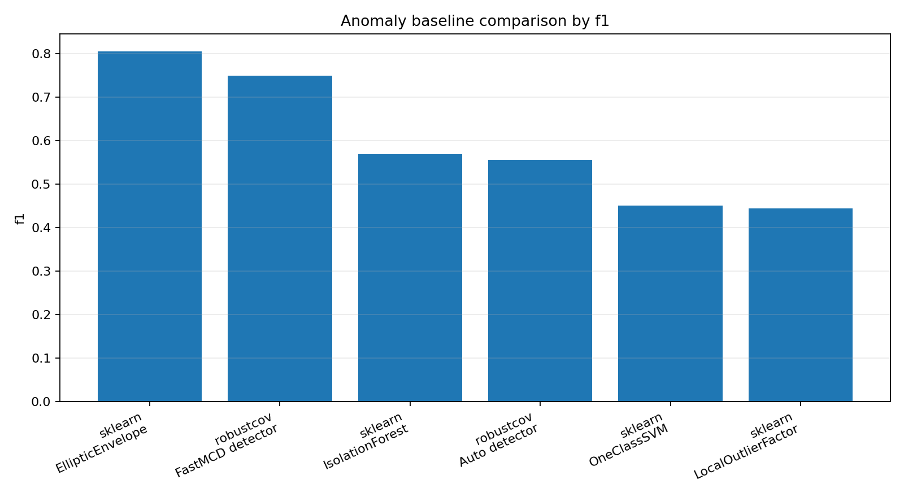

Anomaly detection baselines
===========================

Question
--------

How do robust covariance detectors compare with popular anomaly-detection baselines on a tabular heavy-tail task?

This benchmark is meant for orientation rather than final publication.  It translates robust covariance output into the language many ML users expect: precision, recall, F1, ROC AUC, detection count, and runtime.

Benchmark design
----------------

The data contain heavy-tailed inliers and a small fraction of mixed outliers.  Outliers include both mean-shifted points and leverage-like observations.  The benchmark compares:

* ``robustcov`` FastMCD robust-distance detector;
* ``robustcov`` auto robust anomaly detector;
* sklearn IsolationForest;
* sklearn LocalOutlierFactor;
* sklearn OneClassSVM;
* sklearn EllipticEnvelope.

Results
-------

.. csv-table:: Anomaly baseline comparison
   :file: ../_static/benchmarks/anomaly_baselines.csv
   :header-rows: 1

Interpretation
--------------

The FastMCD detector is the most direct ``robustcov`` baseline for separable tabular anomalies.  It converts robust Mahalanobis distances into anomaly labels using an empirical threshold.  This is the easiest method to explain to users: fit a robust center and covariance, compute robust distances, and flag the largest distances.

``AutoRobustAnomalyDetector`` is intended as a diagnostic ensemble rather than a universal replacement for dedicated anomaly detectors.  It is useful when the user wants a robust covariance view of the data and wants to compare several scatter estimators quickly.

The sklearn methods are included because users will naturally compare against them.  The result to emphasize is not that robust covariance always wins, but that it gives interpretable distances, covariance diagnostics, and a clear geometric explanation of flagged points.

Command
-------

.. code-block:: bash

   python benchmarks/anomaly_detection_baselines.py \
     --n 900 \
     --p 12 \
     --contamination 0.08 \
     --csv results/anomaly_baselines.csv

   python examples/plot_anomaly_baselines.py \
     --input results/anomaly_baselines.csv \
     --output results/anomaly_baselines.png

What to look at first
---------------------

* Use F1 when contamination is known and you care about balanced precision/recall.
* Use ROC AUC when you care more about ranking anomalies than choosing a threshold.
* Inspect robust distance profiles after the benchmark; they explain *why* points are flagged.
