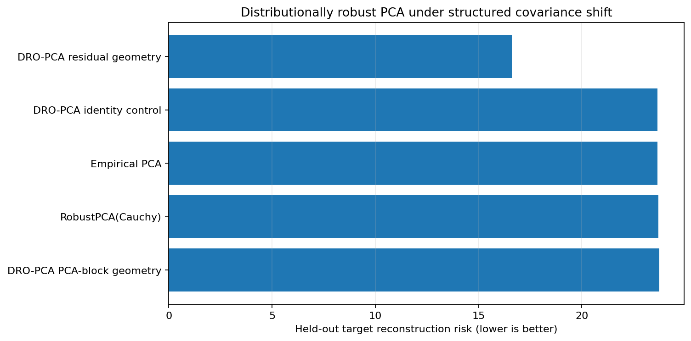

Distributionally robust PCA under held-out shift
================================================

This benchmark evaluates PCA estimators on held-out target distributions rather
than using training reconstruction as evidence of distributional robustness.
It separates three scenarios:

* structured covariance shift;
* no train-to-target distribution shift;
* row contamination without target shift.

The compared methods are empirical PCA, ``RobustPCA`` with Cauchy scatter, the
identity-geometry Wasserstein control, and two anisotropic
``DistributionallyRobustPCA`` geometries.

Run the benchmark
-----------------

.. code-block:: bash

   OPENBLAS_NUM_THREADS=1 MKL_NUM_THREADS=1 OMP_NUM_THREADS=2 \
   python benchmarks/distributionally_robust_pca.py \
       --profile quick \
       --repeats 3 \
       --csv results/distributionally_robust_pca.csv \
       --plot results/distributionally_robust_pca.png

   Lower held-out target reconstruction risk is better.  The identity control
   is expected to coincide with ordinary PCA.

Metrics
-------

``target_risk``
   Mean squared reconstruction loss on an independently sampled target law.

``training_risk``
   Reconstruction loss on the nominal training sample.

``target_projector_error``
   Frobenius error against the target population's leading projector.

``exact_worst_case_risk`` and ``surrogate_risk_bound``
   Fitted ambiguity-set diagnostics for experimental DRO estimators.

Interpretation
--------------

The benchmark is intentionally not merged into the row-contamination PCA
ranking.  A distributionally robust estimator should be judged by performance
under a stated ambiguity/shift model, while contamination-robust estimators
should be judged under outliers, heavy tails, or bad cells.  The no-shift and
contamination-only scenarios expose the efficiency cost and geometry
misspecification risk.
