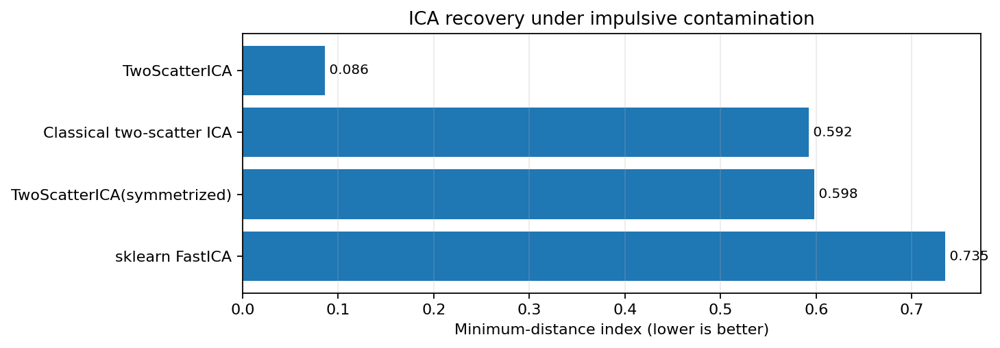
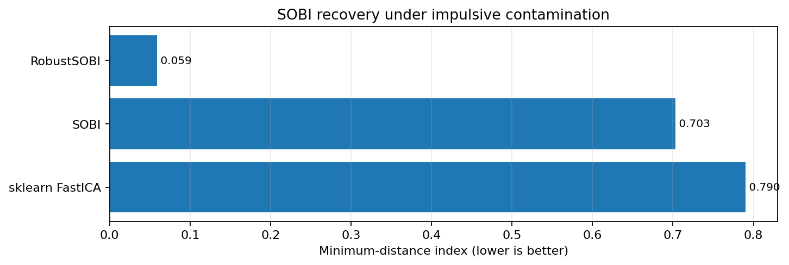
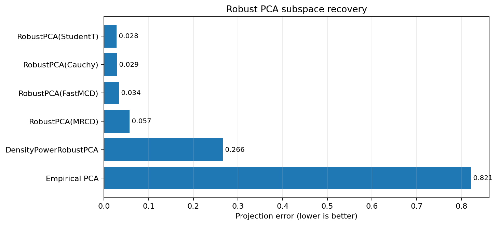
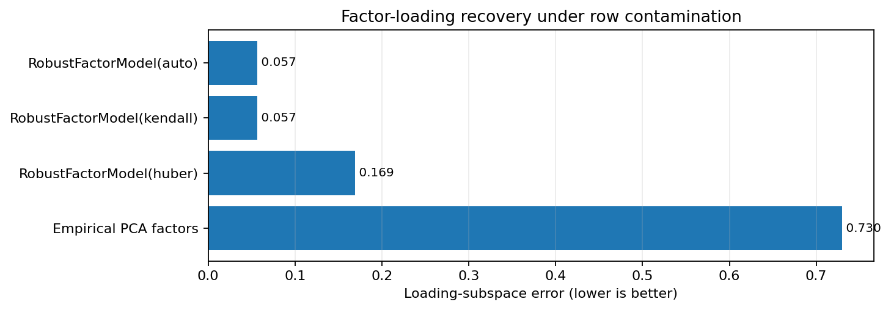

ICA, SOBI, robust PCA, and factor models
========================================

This benchmark group evaluates latent-structure recovery rather than only
covariance estimation.  The tasks remain separate because independent source
recovery, temporal source separation, principal-subspace recovery, and factor
modeling have different identifiability conditions and metrics.

The quick documentation snapshot uses complete estimator fits with fixed
synthetic ground truth.  For release claims, repeat the full profile across
multiple seeds and report medians and interquartile ranges.

Run the benchmark
-----------------

.. code-block:: bash

   OPENBLAS_NUM_THREADS=1 MKL_NUM_THREADS=1 OMP_NUM_THREADS=2 \
   python benchmarks/latent_structure_benchmarks.py \
       --profile quick \
       --repeats 1 \
       --csv results/latent_structure.csv \
       --plot-dir results/latent_structure_plots \
       --rst results/latent_structure.rst

Use ``--profile full --repeats 3`` for a slower timing comparison.  The CSV
contains one row per complete fit and includes status/failure information.

ICA
---

ICA is scored with the minimum-distance index (MDI), Amari index, and matched
absolute source correlation.  These metrics account for the unavoidable
permutation, sign, and scale indeterminacies of independent components.

   Lower MDI means better recovery of the true mixing/unmixing geometry.

SOBI
----

SOBI uses temporally correlated autoregressive sources.  The contaminated
scenario injects large multichannel impulses; ``RobustSOBI`` combines robust
whitening with weighted lag-scatter matrices.

   The non-temporal FastICA baseline is included only when scikit-learn is
   installed.

Robust PCA
----------

The PCA benchmark compares empirical PCA, robust scatter PCA, density-power
PCA, CellPCA, and SparseCellPCA in the contamination regimes for which each is
intended.  The plot below focuses on rowwise low-rank outliers; the CSV also
contains cellwise/missing and sparse-loading scenarios.

   Projection error compares estimated and true subspaces and is invariant to
   rotations within the retained component space.

Robust factor models
--------------------

The factor benchmark compares a classical PCA factor baseline with the
Kendall, Huber-refined, and automatic-factor-count variants of
``RobustFactorModel``.  It reports loading-subspace error, matched factor-score
correlation, common-component reconstruction error, covariance error, and
factor-count error.

Generated snapshot
------------------

.. include:: ../_generated/latent_structure_results.rst
   :start-after: .. latent-structure-body-start

Interpretation limits
---------------------

The benchmark establishes reproducible package behavior on known synthetic
models.  It does not establish universal state of the art.  Source-separation
performance depends on source distributions, temporal signatures, lag choices,
and contamination geometry; factor-model performance depends on factor
strength, idiosyncratic dependence, and factor-number separation.
