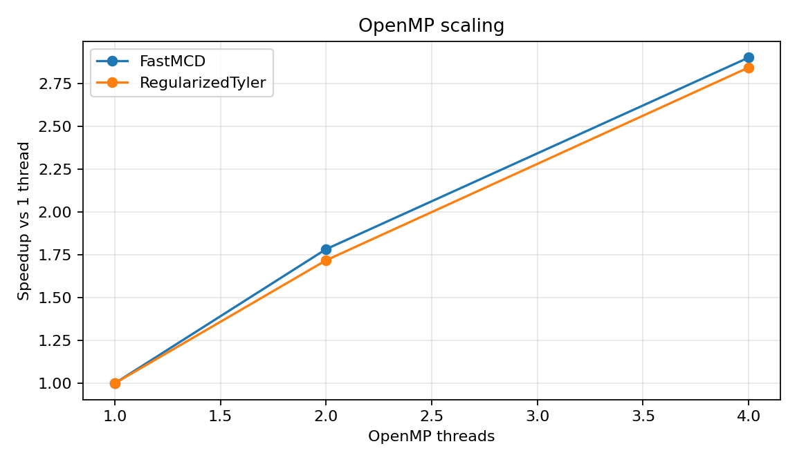

OpenMP scaling benchmark
========================

Question
--------

Does optional OpenMP parallelism improve speed on larger workloads?

Design
------

The benchmark runs the same estimator with different thread counts.  BLAS thread counts should be
set to one so OpenMP and BLAS do not oversubscribe the CPU.

.. code-block:: bash

   OMP_NUM_THREADS=4 OPENBLAS_NUM_THREADS=1 MKL_NUM_THREADS=1 \
   python benchmarks/openmp_scaling.py --n 8000 --p 20 --threads 1 2 4

Scaling table
-------------

.. csv-table:: OpenMP scaling
   :file: ../_static/benchmarks/openmp_scaling.csv
   :header-rows: 1

Plot
----

Interpretation
--------------

OpenMP helps most when the workload has enough rows, enough features, or enough random starts to
pay for threading overhead.  Small examples may not speed up because thread startup and scheduling
costs dominate.  In larger benchmark settings, robust distance evaluation, covariance accumulation,
Tyler updates, and FastMCD candidate evaluation can all benefit.

Practical advice
----------------

Use explicit environment variables for reproducible timing:

.. code-block:: bash

   OMP_NUM_THREADS=4 OPENBLAS_NUM_THREADS=1 MKL_NUM_THREADS=1

Inside Python, users can also control the package thread count:

.. code-block:: python

   import robustcov as rc

   print(rc.has_openmp())
   rc.set_num_threads(4)
   est = rc.FastMCD(n_jobs=4, random_state=0).fit(X)

