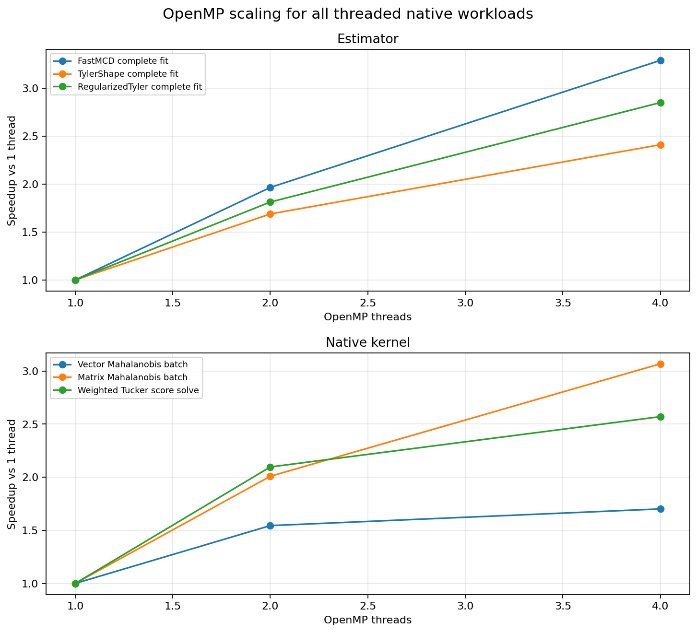

OpenMP scaling for threaded native workloads
============================================

Question
--------

Which estimators and kernels currently use OpenMP, and how do they scale with
thread count on a sufficiently large workload?

Coverage
--------

The benchmark now includes every native operation in the package that contains
an OpenMP-parallel region:

* complete ``FastMCD`` fitting;
* complete ``TylerShape`` fitting;
* complete ``RegularizedTyler`` fitting;
* vector Mahalanobis batches;
* matrix Mahalanobis batches; and
* weighted Tucker score solves used by robust multilinear PCA.

The C++ joint diagonalizer used by SOBI is intentionally not listed here because
it is native but currently single-threaded.  Its Python-versus-C++ acceleration
is measured by ``benchmarks/source_separation_gate.py`` instead.  Native code and
OpenMP-parallel code are not treated as synonyms.

Design
------

Each workload is run at every requested thread count.  The one-thread output is
retained as the numerical baseline, and the CSV reports both speedup and maximum
absolute/relative drift versus that baseline.  BLAS thread counts should remain
one so OpenMP and BLAS do not oversubscribe the CPU.

.. code-block:: bash

   OMP_NUM_THREADS=4 OPENBLAS_NUM_THREADS=1 MKL_NUM_THREADS=1 \
   python benchmarks/openmp_scaling.py \
     --n 8000 --p 20 --threads 1 2 4 \
     --csv results/openmp_scaling.csv

Scaling table
-------------

.. csv-table:: OpenMP estimator and kernel scaling
   :file: ../_static/benchmarks/openmp_scaling.csv
   :header-rows: 1

Plot
----

Interpretation
--------------

OpenMP helps only when the workload is large enough to amortize thread startup,
scheduling, and reductions.  The complete-estimator panel and native-kernel
panel should be read separately: an internal kernel can scale well while the
surrounding estimator remains limited by serial work.

Numerical drift should remain near floating-point roundoff.  A faster threaded
result is not acceptable if it changes the fitted model materially.

Practical advice
----------------

Use explicit environment variables for reproducible timing:

.. code-block:: bash

   OMP_NUM_THREADS=4 OPENBLAS_NUM_THREADS=1 MKL_NUM_THREADS=1

Inside Python, users can also control the package thread count:

.. code-block:: python

   import robustcov as rc

   print(rc.has_openmp())
   rc.set_num_threads(4)
   est = rc.FastMCD(n_jobs=4, random_state=0).fit(X)
