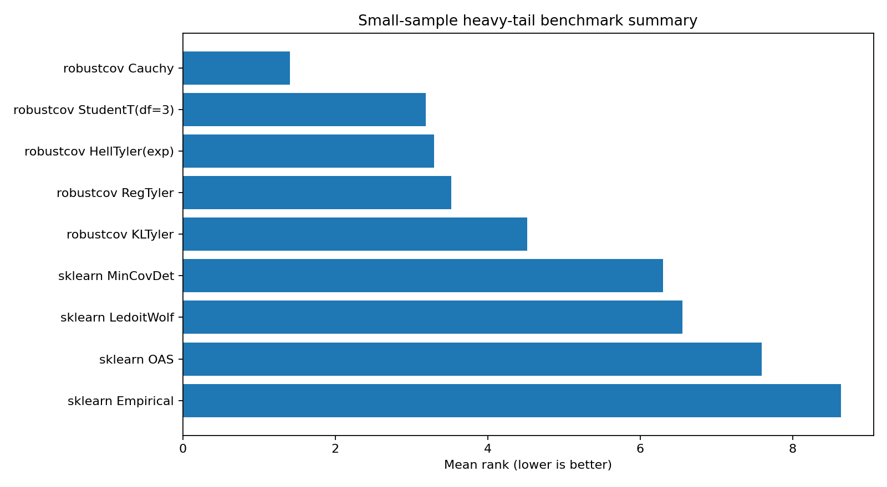

Small-sample heavy-tail benchmark
=================================

Question
--------

What should a user do when the sample size is small, the dimension is not tiny, and the data are
heavy-tailed?  This is the regime where empirical covariance, Ledoit-Wolf, OAS, and classical MCD
can become unstable or misleading.

Design
------

The benchmark simulates elliptical Student-t data over a grid of sample sizes, feature dimensions,
and degrees of freedom.  Smaller degrees of freedom mean heavier tails.  For each setting, each
estimator is compared to the known population scatter using relative Frobenius error.

The main output is not a single timing number.  It is the ranking across the whole grid: win rate,
mean rank, median error, and median runtime.

Summary table
-------------

.. csv-table:: Small-sample heavy-tail summary
   :file: ../_static/benchmarks/small_sample_summary.csv
   :header-rows: 1

Ranking plot
------------

Interpretation
--------------

The important result is that ``RegularizedCauchy`` is the strongest default in this grid.  It has
high win rate, low mean rank, and low median error.  ``StudentTScatter`` is often close and is a
smoother alternative when the user wants less aggressive Cauchy-style radial downweighting.

The benchmark also explains why the package should not be positioned as a generic collection of
older robust estimators.  MVE is historically important, but the strongest evidence here is for
regularized heavy-tail scatter in small-sample settings.

Run it yourself
---------------

.. code-block:: bash

   python benchmarks/small_sample_heavy_tail.py --csv results/small_sample.csv
   python benchmarks/benchmark_summary.py \
     --input results/small_sample.csv \
     --csv results/small_sample_summary.csv \
     --html results/small_sample_summary.html \
     --markdown results/small_sample_summary.md

