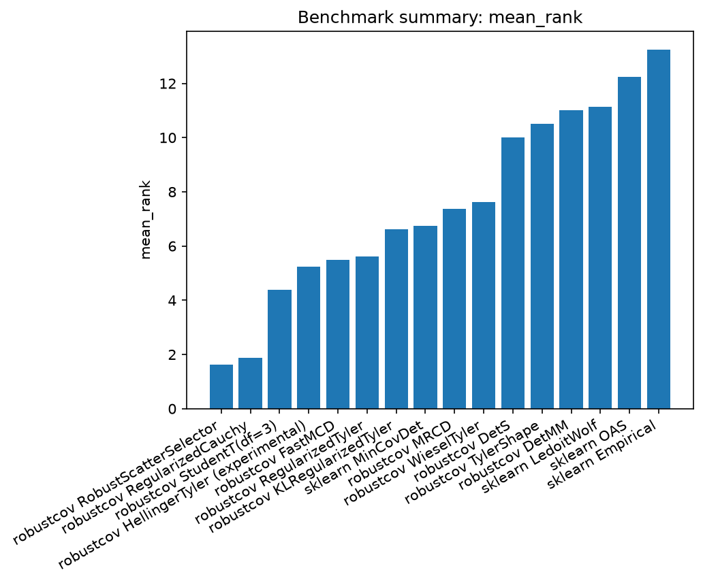

Small-sample rowwise covariance and scatter benchmark
=====================================================

Question
--------

Which covariance or scatter estimator should a user consider when the sample is
small, the feature dimension is not tiny, and the observations are heavy-tailed?
This includes both :math:`p < n` and :math:`p \ge n` regimes.

Method coverage
---------------

The benchmark now uses the shared covariance benchmark catalog rather than a
hand-maintained subset.  It includes, where mathematically applicable:

* empirical covariance, Ledoit-Wolf, and OAS;
* sklearn ``MinCovDet`` and native ``FastMCD``;
* ``MRCD`` for regularized high-dimensional subset estimation;
* deterministic S and MM estimators;
* unregularized, regularized, KL-labelled, and Wiesel-labelled Tyler variants;
* Student-t and regularized Cauchy M-scatter;
* the explicitly labelled experimental Hellinger-style prototype; and
* ``AutoRobustScatter`` as a selector workflow whose timing includes fitting its
  candidate set.

Methods with structural requirements are recorded as ``not_applicable`` rather
than being counted as failures.  For example, unregularized Tyler requires full
column rank, classical MCD needs a raw support larger than :math:`p`, and DetS /
DetMM require :math:`\lceil n/2 \rceil > p`.

Design
------

The benchmark simulates elliptical Student-t data over a grid of sample sizes,
feature dimensions, and degrees of freedom.  Smaller degrees of freedom mean
heavier tails.  For :math:`\nu \le 2`, population covariance is undefined, so
all methods are compared with the known generating *scatter* matrix rather than
being described as covariance-consistent in that regime.

The main output is the ranking across the whole grid: eligibility, success rate,
win rate, mean rank, median scatter error, and median runtime.

Summary table
-------------

.. csv-table:: Small-sample heavy-tail summary
   :file: ../_static/benchmarks/small_sample_summary.csv
   :header-rows: 1

Ranking plot
------------

Interpretation
--------------

No estimator is eligible in every mathematical regime for the same reason.
``MRCD`` and the regularized M-scatter/Tyler families remain available when
:math:`p \ge n`, while classical MCD, unregularized Tyler, DetS, and DetMM are
shown only where their defining assumptions are satisfied.

The ranking should therefore be read together with ``eligible``, ``success_rate``,
and ``not_applicable``.  A method that performs strongly in the low-dimensional
part of the grid should not be described as a high-dimensional default merely
because its ineligible rows were omitted.

Run it yourself
---------------

.. code-block:: bash

   python benchmarks/small_sample_heavy_tail.py \
     --profile quick \
     --repeat 2 \
     --csv results/small_sample.csv

   python benchmarks/benchmark_summary.py \
     --input results/small_sample.csv \
     --csv results/small_sample_summary.csv \
     --html results/small_sample_summary.html \
     --markdown results/small_sample_summary.md

Use ``--profile full`` for the larger historical grid.  Use ``--exclude-experimental`` or ``--exclude-selector`` when a narrower table
is desired.  Use ``--methods`` with exact catalog labels for a focused rerun.
