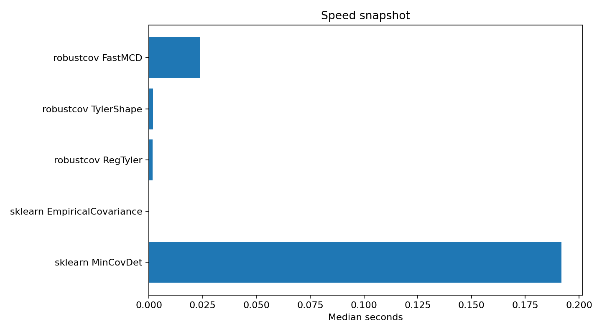

Speed comparison
================

Question
--------

How fast is ``robustcov`` compared with common sklearn covariance baselines?

Design
------

This benchmark uses a representative classical contamination setting and compares robustcov FastMCD,
Tyler-family estimators, sklearn empirical covariance, and sklearn MinCovDet.  Empirical covariance
is included as a non-robust lower-bound reference; the most meaningful robust comparison is
``robustcov FastMCD`` versus ``sklearn MinCovDet``.

Timing table
------------

.. csv-table:: Speed comparison
   :file: ../_static/benchmarks/speed.csv
   :header-rows: 1

Plot
----

Interpretation
--------------

FastMCD is the package's classical robust-covariance workhorse.  The speed benchmark shows why it is
worth keeping even though the newer heavy-tail estimators are the main small-sample differentiator.
When users have separable contamination and :math:`n \gg p`, FastMCD is easy to explain, fast, and
compatible with robust-distance anomaly diagnostics.

Run it yourself
---------------

.. code-block:: bash

   python benchmarks/speed_estimators.py --n 2000 --p 10 --repeat 5 --quality fast --csv results/speed.csv
   python examples/plot_speed_comparison.py --input results/speed.csv --output results/speed.png

