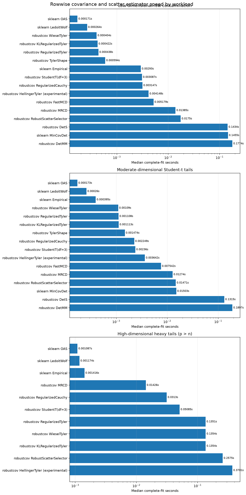

Rowwise covariance and scatter speed by workload
================================================

Question
--------

How expensive are the current covariance and scatter estimators on the regimes
where users would actually choose them?

Design
------

The previous speed snapshot timed only FastMCD, two Tyler variants, empirical
covariance, and sklearn MinCovDet on one low-dimensional contamination dataset.
That was useful for the first package iteration but no longer represented the
public estimator surface.

The updated benchmark uses the same shared catalog as the heavy-tail accuracy
benchmark and separates three workloads:

* low-dimensional row contamination;
* moderate-dimensional Student-t tails; and
* high-dimensional heavy tails with :math:`p > n`.

It includes FastMCD, MRCD, DetS, DetMM, Tyler variants, Student-t scatter,
regularized Cauchy, the experimental Hellinger prototype, the automatic selector,
and sklearn empirical/shrinkage/MCD baselines wherever each method is
applicable.  ``AutoRobustScatter`` is labelled as a workflow because its runtime
includes fitting and selecting several candidate estimators.

The benchmark reports complete ``fit`` time.  It is not a microbenchmark of one
matrix operation, and it does not mix ICA, PCA, or factor-model runtimes into a
covariance table; those tasks have their own latent-structure benchmark.

Timing table
------------

.. csv-table:: Workload-aware covariance/scatter speed comparison
   :file: ../_static/benchmarks/speed.csv
   :header-rows: 1

Plot
----

Interpretation
--------------

Empirical and shrinkage covariance remain useful lower-bound timing references,
but they do not provide the same robustness guarantees.  High-breakdown subset
methods, iterative M-scatter, regularized shape estimators, and automatic model
selection solve different robust tasks and naturally have different costs.

Read timing together with the accuracy and contamination benchmarks.  A method
should not be selected only because it is fastest on a workload for which its
statistical error is poor.

The committed CSV is a local release-candidate snapshot.  Compiler, BLAS,
processor, and thread settings are recorded in
``docs/_static/release_evidence.json``.  Runtime ratios must be regenerated on
the target machine and are intentionally not presented as portable package
constants.

Run it yourself
---------------

.. code-block:: bash

   OPENBLAS_NUM_THREADS=1 MKL_NUM_THREADS=1 OMP_NUM_THREADS=2 \
   python benchmarks/speed_estimators.py \
     --profile quick \
     --repeat 2 \
     --csv results/speed.csv

   python examples/plot_speed_comparison.py \
     --input results/speed.csv \
     --output results/speed.png

Use ``--profile full`` for larger datasets, ``--workloads`` for a subset, and
``--methods`` for exact method labels.
