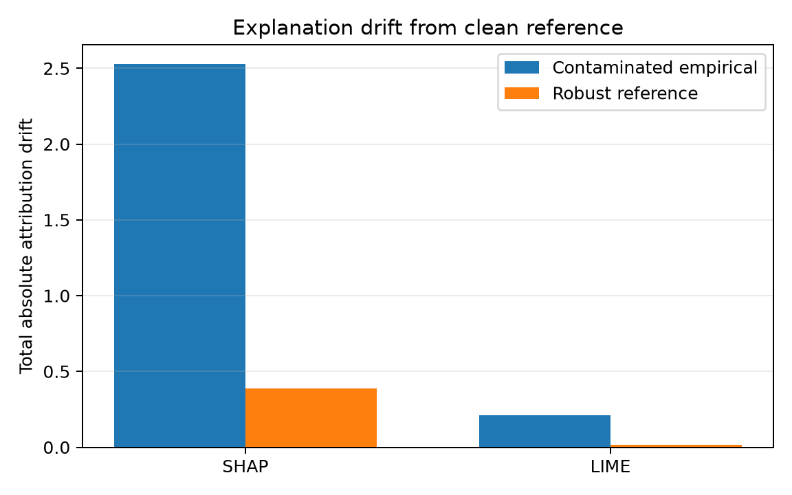

Robust SHAP and LIME references
===============================

SHAP and LIME already implement the explanation algorithms. RobustCov does not
replace them. It supplies the part they intentionally leave to the user: a
reference distribution and, for LIME, a locality metric.

This matters when the model is sound but the matrix used by the explainer
contains leverage points, failed measurements, corrupted embeddings, or a small
number of observations from a different regime. A contaminated explanation
reference can move SHAP baselines, distort feature dependence, alter LIME's
perturbation scale, and change which synthetic neighbors receive the most
weight.

Install the optional integrations with:

.. code-block:: console

   python -m pip install "robustcov[explain]"

Build one robust reference
--------------------------

``RobustExplanationReference`` fits a RobustCov scatter estimator and exposes:

* ``background_``: representative central rows for model-agnostic masking;
* ``location_`` and ``covariance_``: a robust Gaussian reference for linear SHAP;
* ``precision_``: a full-matrix locality metric for continuous tabular LIME;
* ``support_`` and ``background_indices_``: diagnostics showing which rows were
  retained.

.. code-block:: python

   import robustcov as rc

   reference = rc.RobustExplanationReference(
       estimator=rc.FastMCD(quality="balanced", random_state=0),
       max_samples=100,
   ).fit(X_reference)

   print(reference.support_fraction_)
   print(reference.background_.shape)

The default estimator is ``RegularizedCauchy``, which remains usable in small
sample and high-dimensional settings. Pass ``FastMCD`` when rowwise
contamination and a high-breakdown subset model are appropriate.

SHAP
----

For a general model, RobustCov passes the robust background to SHAP's
independent masker:

.. code-block:: python

   explainer = rc.make_shap_explainer(
       model.predict_proba,
       reference,
       algorithm="permutation",
       feature_names=feature_names,
   )
   values = explainer(X_to_explain)

For a fitted linear model, correlation-dependent SHAP can use the robust
location and covariance directly:

.. code-block:: python

   explainer = rc.make_shap_explainer(
       linear_model,
       reference,
       correlation_dependent=True,
       nsamples=1000,
   )
   values = explainer(X_to_explain)

The second form is where the covariance estimate matters most: SHAP's linear
imputation masker uses feature dependence to share attribution among correlated
features. Returned SHAP explainers expose the fitted reference as
``robust_reference_`` so its support and background remain inspectable.

LIME
----

The LIME adapter uses ``background_`` for perturbation statistics and converts
``precision_`` into LIME's internally standardized coordinate system. LIME
still generates the neighborhood and fits the local surrogate.

.. code-block:: python

   explainer = rc.make_lime_tabular_explainer(
       reference,
       mode="classification",
       feature_names=feature_names,
       class_names=class_names,
   )

   explanation = explainer.explain_instance(
       X_to_explain[0],
       model.predict_proba,
       labels=(1,),
       num_features=8,
       num_samples=3000,
   )

The robust full-matrix metric currently targets dense continuous features and
therefore keeps ``discretize_continuous=False``. Use upstream LIME directly for
mixed categorical tables, text, or images.

Contaminated Iris demonstration
-------------------------------

``examples/robust_explanations_iris.py`` uses the Iris data from a standard
SHAP tabular example, restricts it to a binary logistic-regression problem, and
then contaminates only the explainer reference matrix. The predictive model and
the query remain unchanged. It reports the attribution drift from the clean
reference for:

* an ordinary empirical reference built from the contaminated matrix; and
* the robust reference built from that same contaminated matrix.

Run it with:

.. code-block:: console

   python examples/robust_explanations_iris.py

The release-candidate snapshot retains none of the twelve injected leverage
rows.  For the fixed query and model, total absolute SHAP drift from the clean
reference is ``2.528`` with the contaminated empirical reference and ``0.388``
with the robust reference.

.. literalinclude:: _static/examples/robust_explanations_iris_output.txt
   :language: text

The machine-readable result is stored in
``docs/_static/examples/robust_explanations_iris.json`` and is hashed by the
release evidence manifest. Treat the values as a controlled example, not a
universal performance claim; explanation stability depends on the model,
query, contamination pattern, and explainer settings.

Scope and interpretation
------------------------

These adapters make the *explanation reference* robust. They do not repair a
model trained on corrupted labels or contaminated predictors, prove that an
explanation is causal, or choose the scientifically correct reference
population. The robust support should be inspected rather than accepted
blindly, especially when rare but legitimate subpopulations may look like
outliers.
