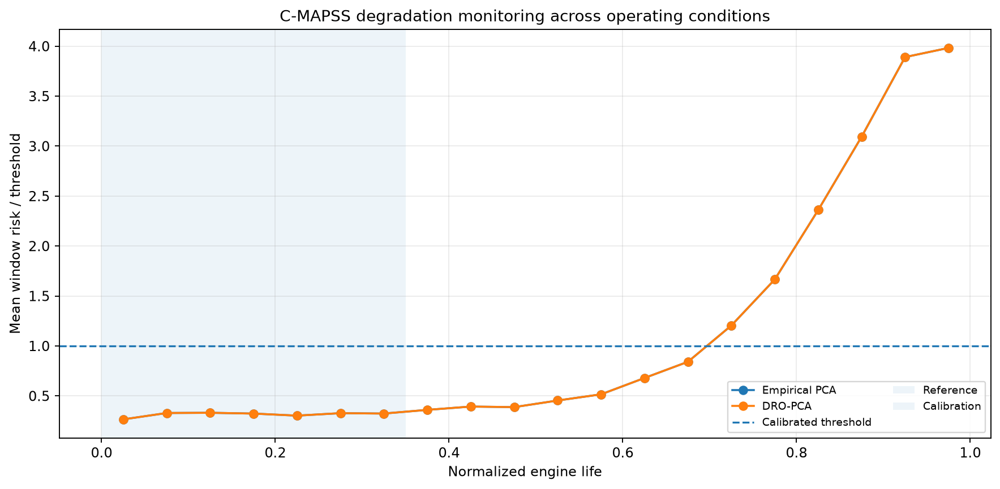
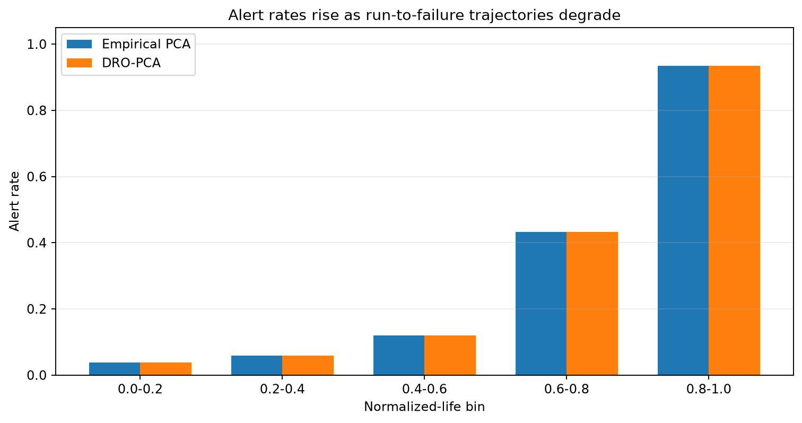
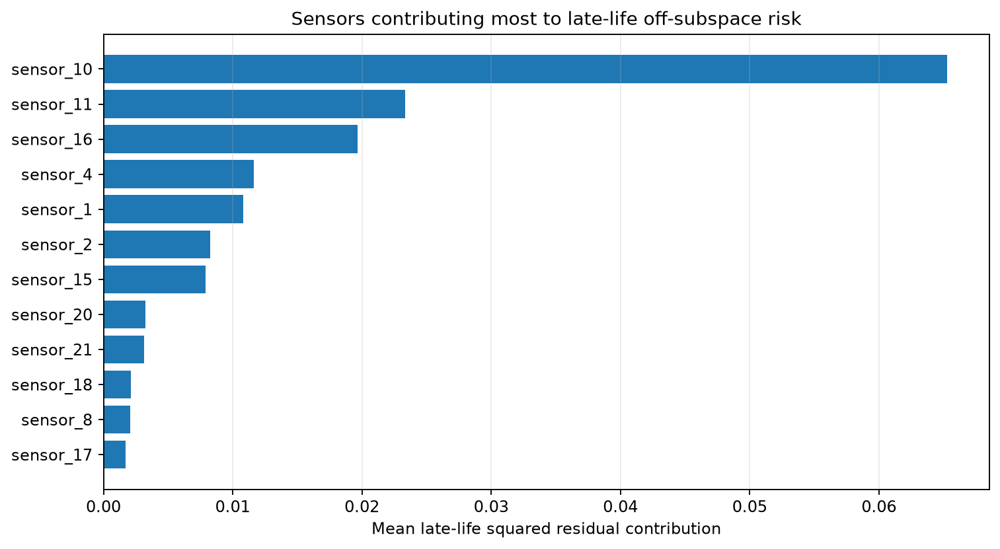

NASA C-MAPSS FD002
==================

.. note::

   **Reviewed reference snapshot.** The dataset was processed locally. Read the Docs
   renders committed aggregate outputs and does not download or execute this benchmark.

FD002 contains six operating conditions and one fault mode, separating tolerated regime changes from progressive degradation.

Protocol
--------

DRO-PCA degradation monitoring across operating regimes.

   Risk over engine life.

   Alert rate by life interval.

   Late-life sensor contributions.

Aggregate outputs
-----------------

* :download:`summary.csv <../_static/external_results/cmapss_fd002/summary.csv>`

Provenance
----------

.. list-table::
   :header-rows: 1

   * - Field
     - Value
   * - Generated (UTC)
     - 2026-07-20T07:40:47+00:00
   * - Git commit
     - ``5f9696f95486b9d31f0e419da705e2961fddd03e``
   * - Command
     - ``python examples_external/cmapss_dro_pca_monitoring.py --download --subset FD002 --outdir results/external/cmapss_fd002``
   * - Archive SHA-256
     - ``c9c5dec12a945a82e8bb4446589d7fb3cc057b5e5d81fa1a12e25ee9912ad3b2``
   * - Dataset citation
     - A. Saxena and K. Goebel (2008). Turbofan Engine Degradation Simulation Data Set, NASA Ames Prognostics Data Repository, NASA Ames Research Center.
   * - Dataset homepage
     - https://data.nasa.gov/dataset/cmapss-jet-engine-simulated-data

The full raw dataset, cache, row-level scores, and local filesystem paths are not
included in this repository or its release artifacts.
