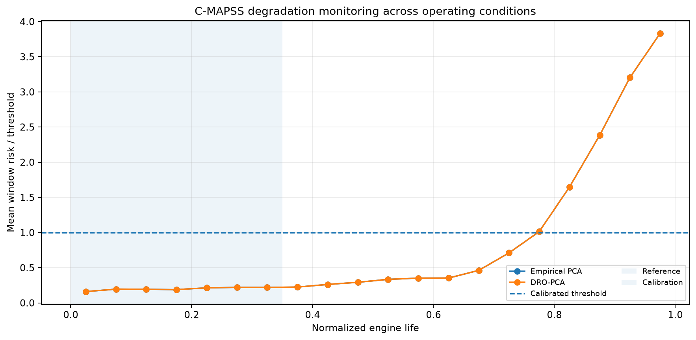
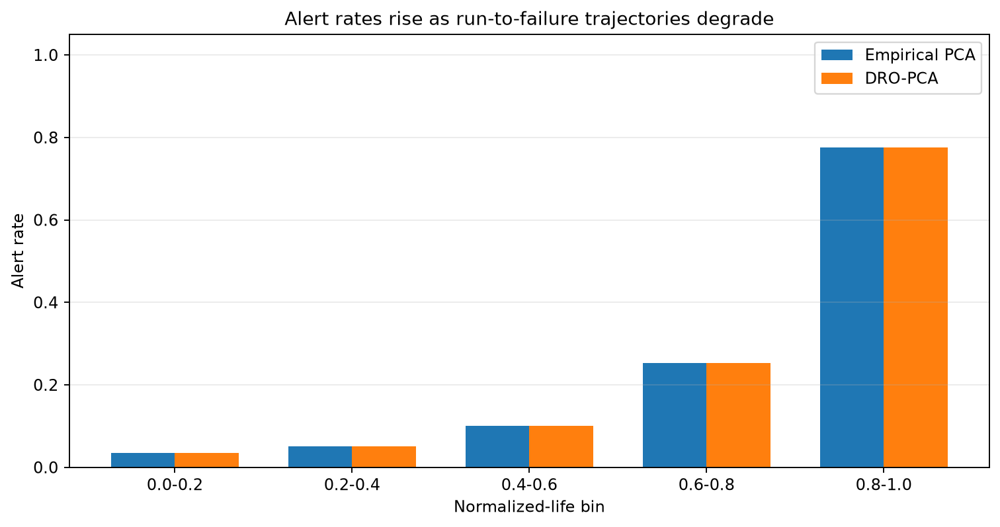
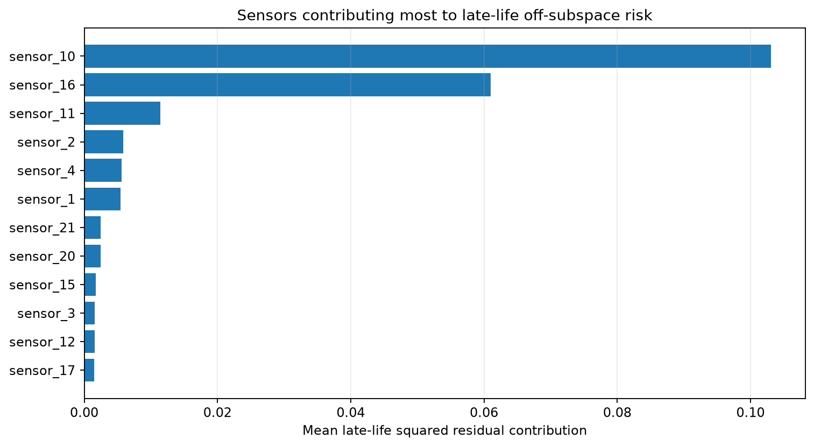

NASA C-MAPSS FD004
==================

.. note::

   **Reviewed reference snapshot.** The dataset was processed locally. Read the Docs
   renders committed aggregate outputs and does not download or execute this benchmark.

FD004 contains six operating conditions and two fault modes, providing the harder anticipated-regime-versus-degradation benchmark.

Protocol
--------

DRO-PCA degradation monitoring across operating regimes.

Interpretation
--------------

* **Empirical PCA:** alert rate changes from 3.4% in the first life interval to 77.5% in the final interval.
* **DRO-PCA:** alert rate changes from 3.4% in the first life interval to 77.5% in the final interval.
* The fitted DRO-PCA and empirical-PCA projectors are numerically equivalent (Frobenius distance 0); the curves may overlap.
* DRO candidate selection: source ``path``, gamma ``0.0``.
* This snapshot validates the monitoring workflow on this fixed protocol; it does not establish universal superiority of one PCA estimator.

   Risk over engine life.

   Alert rate by life interval.

   Late-life sensor contributions.

Aggregate outputs
-----------------

* :download:`summary.csv <../_static/external_results/cmapss_fd004/summary.csv>`

Provenance
----------

.. list-table::
   :header-rows: 1

   * - Field
     - Value
   * - Generated (UTC)
     - 2026-07-20T13:37:22+00:00
   * - Git commit
     - ``6f93e1d3c6c53e85a2fcbd38f9e44c2e03c5dbfd``
   * - Command
     - ``python examples_external/cmapss_dro_pca_monitoring.py --subset FD004 --outdir results/external/cmapss_fd004``
   * - Archive SHA-256
     - ``c9c5dec12a945a82e8bb4446589d7fb3cc057b5e5d81fa1a12e25ee9912ad3b2``
   * - Dataset citation
     - A. Saxena and K. Goebel (2008). Turbofan Engine Degradation Simulation Data Set, NASA Ames Prognostics Data Repository, NASA Ames Research Center.
   * - Dataset homepage
     - https://data.nasa.gov/dataset/cmapss-jet-engine-simulated-data
   * - Requested false-alarm rate
     - 0.05
   * - DRO candidate source
     - ``path``
   * - DRO selected gamma
     - ``0.0``
   * - Projector distance to empirical
     - ``0.0``

The full raw dataset, cache, row-level scores, and local filesystem paths are not
included in this repository or its release artifacts.
