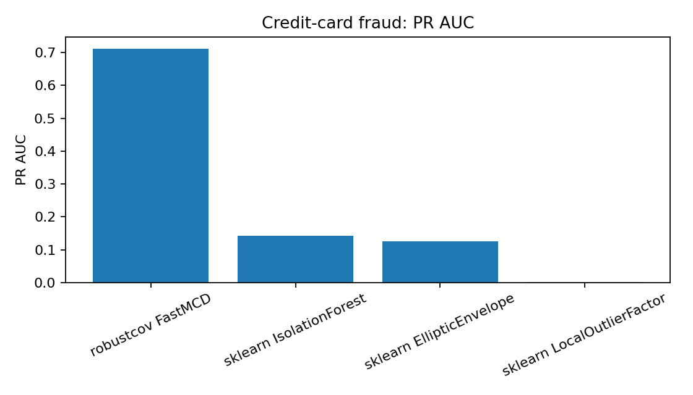
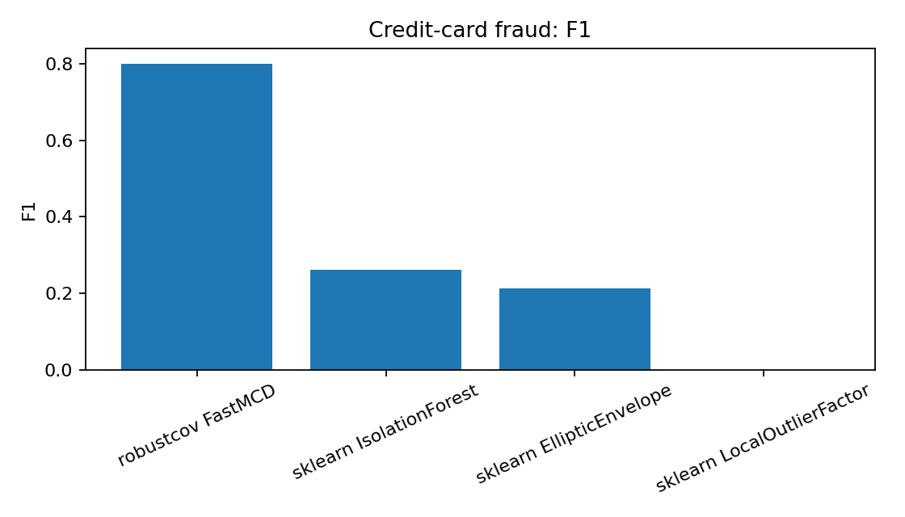

Credit-card fraud result
========================

Why this result matters
-----------------------

Credit-card fraud is a popular imbalanced anomaly-detection benchmark.  It is a
useful public example because users already understand the task, and because
PR AUC and F1 are more informative than accuracy on rare fraud events.

Observed result
---------------

A local external run reported the following table.

.. list-table:: Credit-card fraud external result
   :header-rows: 1

   * - Method
     - Seconds
     - Precision
     - Recall
     - F1
     - ROC AUC
     - PR AUC
   * - robustcov FastMCD
     - 57.202
     - 0.801
     - 0.801
     - 0.801
     - 0.957
     - 0.712
   * - sklearn IsolationForest
     - 3.392
     - 0.262
     - 0.262
     - 0.262
     - 0.948
     - 0.143
   * - sklearn EllipticEnvelope
     - 12.518
     - 0.213
     - 0.213
     - 0.213
     - 0.920
     - 0.125
   * - sklearn LocalOutlierFactor
     - 35.981
     - 0.000
     - 0.000
     - 0.000
     - 0.513
     - 0.002

Plots
-----

   PR-AUC comparison.  This metric is important for rare fraud because it
   focuses on precision/recall behavior under severe class imbalance.

   Thresholded F1 comparison at the same detected-count level.

Output from the run
-------------------

.. literalinclude:: ../_static/external_results/credit_card_fraud/output.txt
   :language: text

Interpretation
--------------

``robustcov FastMCD`` was slower than ``IsolationForest`` in this run, but it
produced a much stronger thresholded fraud-screening result and a much higher
PR AUC.  This is a good Kaggle/notebook story because the robust-distance score
is interpretable and the metric gap is large.

How to reproduce
----------------

Download the credit-card fraud CSV manually, then run:

.. code-block:: bash

   python examples_external/kaggle_credit_card_fraud.py \
     --data /path/to/creditcard.csv \
     --outdir results/external/credit_card_fraud

Outputs
-------

The script writes:

* ``metrics.csv``;
* ``pr_auc.png``;
* ``f1.png``;
* ``robust_score_profile.png``;
* ``summary.md``.

Production note
---------------

This should be presented as an unsupervised screening score, not as a full
competition-winning fraud pipeline.  In supervised Kaggle settings, the robust
score can also be used as a feature for gradient boosting or other classifiers.
