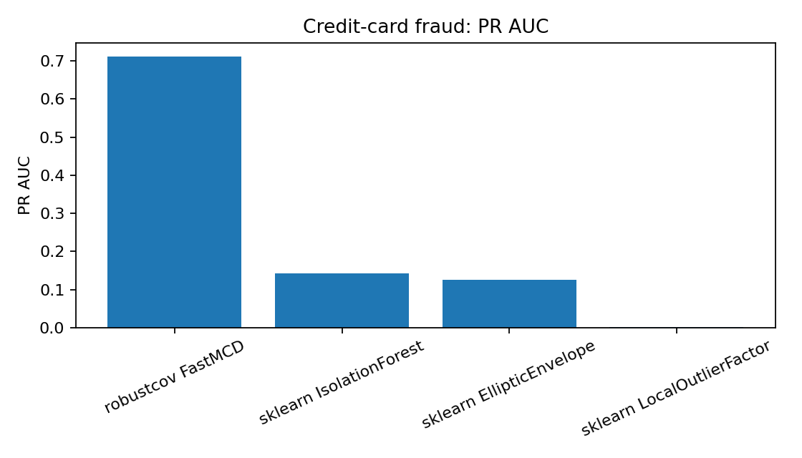
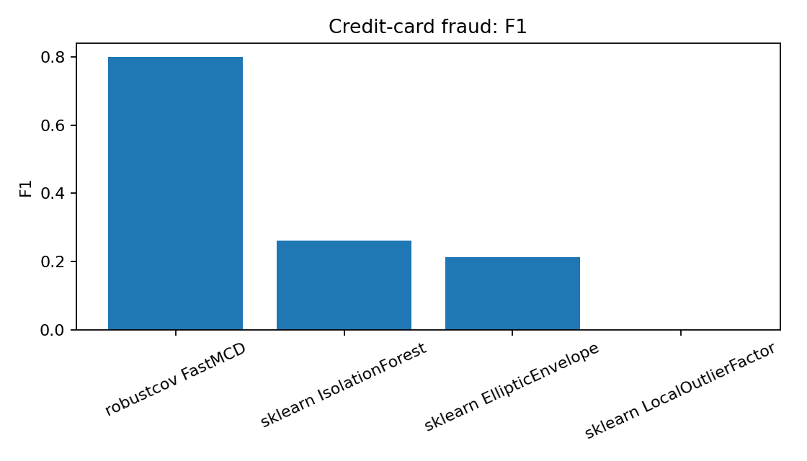

Credit-card fraud result
========================

Benchmark context
-----------------

Credit-card fraud is a familiar imbalanced benchmark.  The table therefore
reports PR AUC and F1 rather than accuracy, which can look high even when nearly
all fraud cases are missed.

Observed result
---------------

A local external run reported the following table.

.. list-table:: Credit-card fraud external result
   :header-rows: 1

   * - Method
     - Seconds
     - Precision
     - Recall
     - F1
     - ROC AUC
     - PR AUC
   * - robustcov FastMCD
     - 57.202
     - 0.801
     - 0.801
     - 0.801
     - 0.957
     - 0.712
   * - sklearn IsolationForest
     - 3.392
     - 0.262
     - 0.262
     - 0.262
     - 0.948
     - 0.143
   * - sklearn EllipticEnvelope
     - 12.518
     - 0.213
     - 0.213
     - 0.213
     - 0.920
     - 0.125
   * - sklearn LocalOutlierFactor
     - 35.981
     - 0.000
     - 0.000
     - 0.000
     - 0.513
     - 0.002

Plots
-----

   PR-AUC comparison.  This metric is important for rare fraud because it
   focuses on precision/recall behavior under severe class imbalance.

   Thresholded F1 comparison at the same detected-count level.

Console output
--------------

.. literalinclude:: ../_static/external_results/credit_card_fraud/output.txt
   :language: text

Reading the comparison
----------------------

``robustcov FastMCD`` is slower than ``IsolationForest`` in this run, but its
thresholded result and PR AUC are substantially better.  The robust distance
also gives a direct ranking of transactions for manual review.

Run the benchmark
-----------------

Download the credit-card fraud CSV manually, then run:

.. code-block:: bash

   python examples_external/kaggle_credit_card_fraud.py \
     --data /path/to/creditcard.csv \
     --outdir results/external/credit_card_fraud

Outputs
-------

The script writes:

* ``metrics.csv``;
* ``pr_auc.png``;
* ``f1.png``;
* ``robust_score_profile.png``;
* ``summary.md``.

Using the score in a fraud pipeline
-----------------------------------

Treat the result as an unsupervised screening score.  When labels are
available, the robust distance can be added as a feature to a supervised fraud
model rather than used as the whole pipeline.
