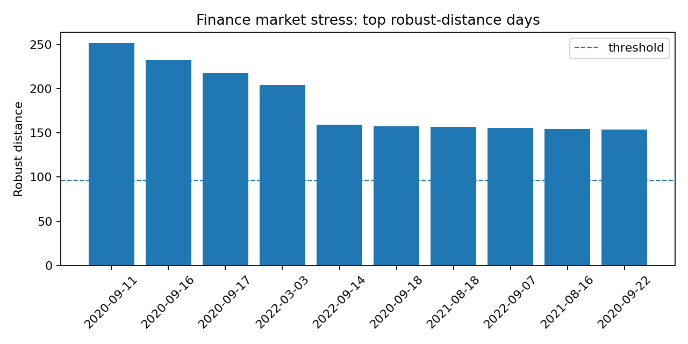
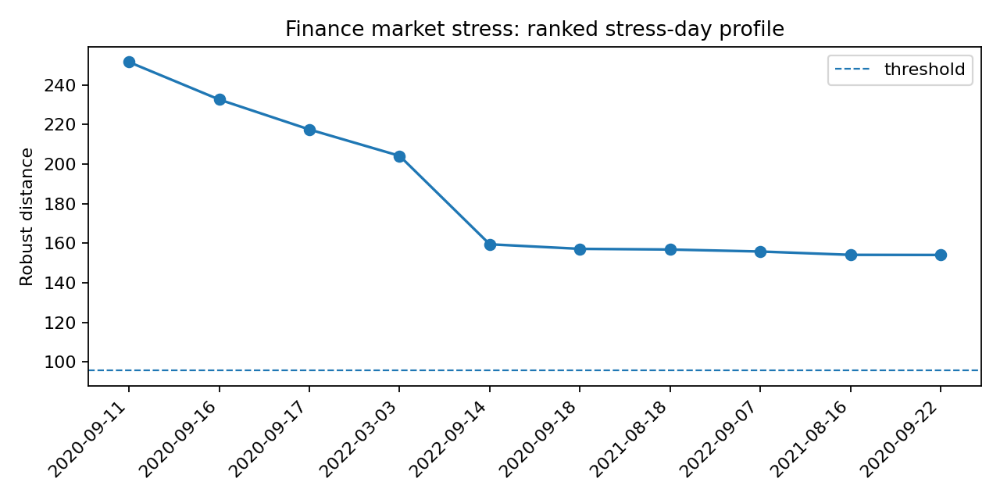

Finance market-stress anomaly detection
=======================================

Why this result matters
-----------------------

Financial returns are heavy-tailed and correlated across assets.  A single
large move in one asset is not always a market anomaly, but an unusual
cross-asset return vector can indicate stress, regime change, a macro shock, or
data-quality problems.  Robust covariance gives an interpretable score for each
trading day: the robust Mahalanobis distance from the central market regime.

What the data represent
-----------------------

This documented run uses a reproducible synthetic price table with 899 return
days and 8 assets.  The generator injects stress-like periods so that the script
can be run without downloading Yahoo/Kaggle data while still producing a
finance-shaped example.

The input format is a CSV with one date column and one numeric price column per
asset:

.. code-block:: text

   date,SPY,QQQ,IWM,TLT,GLD,EFA,EEM,HYG
   2020-01-01,100.0,...

Command
-------

.. code-block:: bash

   python examples_external/finance_market_stress.py \
     --prices examples_external/data/prices.csv \
     --outdir results/external/finance_market_stress

Output from the run
-------------------

.. literalinclude:: ../_static/external_results/finance_market_stress/output.txt
   :language: text

Summary metrics
---------------

.. list-table:: Finance market-stress result
   :header-rows: 1

   * - Method
     - Days
     - Assets
     - Alpha
     - Detected days
     - Threshold
     - Max distance
     - Median distance
     - Radial kurtosis
     - Condition number
   * - RegularizedCauchy
     - 899
     - 8
     - 0.975
     - 23
     - 95.80
     - 251.56
     - 7.34
     - 2.82
     - 6.07

Plots
-----

   Top ranked robust-distance days.  The dashed line is the detection threshold.
   The largest detected day is 2020-09-11 with robust distance 251.56.

   Ranked stress-day profile for the top detected dates.  A finance user can
   inspect the dates directly and compare them against known market events or
   injected stress periods.

Interpretation
--------------

The estimator flags 23 of 899 days, about 2.6%, which is consistent with the
``alpha=0.975`` threshold.  The condition number is low (about 6.1), so the
robust covariance estimate is numerically stable.  The radial kurtosis is not
extreme, meaning the robust fit has absorbed the central heavy-tailed behavior
without becoming ill-conditioned.

The top stress days cluster around stress-like periods, especially September
2020 and September 2022 in this synthetic run.  This makes the result easy to
explain: ``robustcov`` is not only returning a score, it is producing a ranked
list of market days for review.

Why this estimator
------------------

Start with ``RegularizedCauchy`` for finance returns because it combines strong
radial downweighting with shrinkage.  Use ``StudentTScatter`` as a smoother
heavy-tail sensitivity check, and ``AutoRobustScatter`` if the data regime is
unclear.

Production notes
----------------

For real data, run the same script on ETF or stock prices.  Review top days
against market calendars, corporate actions, missing prices, and known stress
events.  For portfolio use, robust distances should complement risk models; they
should not be treated as trading signals without validation.
