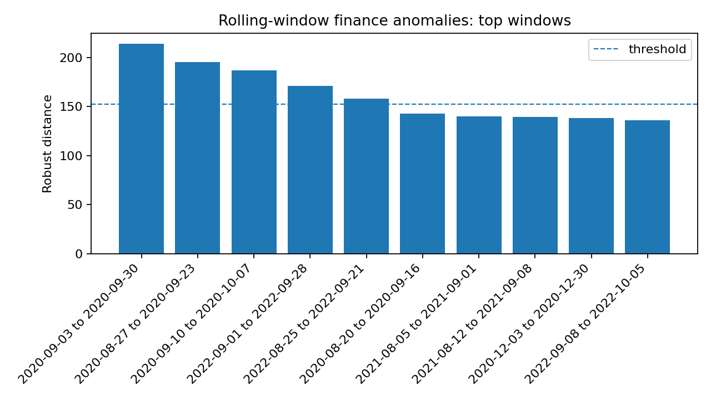
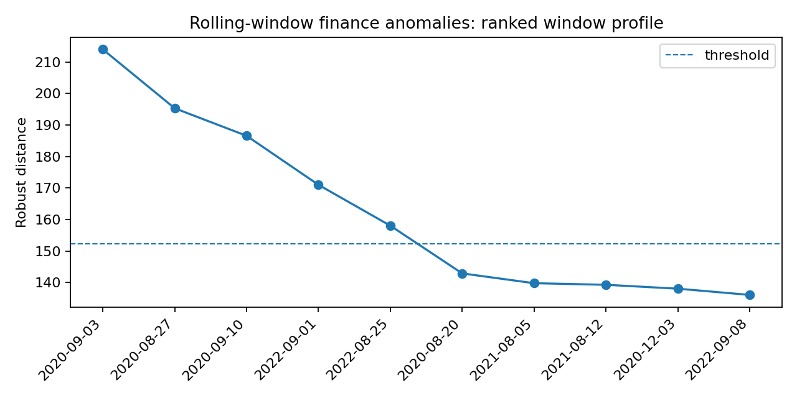

Rolling-window finance anomaly detection
========================================

Why this result matters
-----------------------

Single-day outliers are useful, but many financial anomalies are regimes:
periods of unusual volatility, correlation, drawdown, or cross-asset behavior.
This example converts price data into rolling-window features and scores each
window with robust distances.

What the data represent
-----------------------

This documented run uses the same reproducible synthetic price table as the
single-day market-stress example.  The script forms 20-trading-day windows with
a 5-day step, producing 176 windows over 8 assets.

Command
-------

.. code-block:: bash

   python examples_external/finance_rolling_window_anomaly.py \
     --prices examples_external/data/prices.csv \
     --window 20 \
     --step 5 \
     --outdir results/external/finance_rolling_window

Output from the run
-------------------

.. literalinclude:: ../_static/external_results/finance_rolling_window/output.txt
   :language: text

Summary metrics
---------------

.. list-table:: Rolling-window finance result
   :header-rows: 1

   * - Method
     - Windows
     - Window length
     - Step
     - Assets
     - Detected windows
     - Threshold
     - Max distance
     - Radial kurtosis
   * - RegularizedCauchy
     - 176
     - 20
     - 5
     - 8
     - 5
     - 152.37
     - 214.03
     - 3.98

Plots
-----

   Top anomalous rolling windows.  The top three windows overlap the September
   2020 stress period, showing that the method detects regimes rather than only
   isolated points.

   Ranked window-level robust-distance profile.  Windows above the threshold are
   the first regime candidates to inspect.

Interpretation
--------------

The rolling example detects 5 windows above the threshold.  The top windows are:

.. list-table:: Top anomalous windows
   :header-rows: 1

   * - Rank
     - Start date
     - End date
     - Robust distance
   * - 1
     - 2020-09-03
     - 2020-09-30
     - 214.03
   * - 2
     - 2020-08-27
     - 2020-09-23
     - 195.33
   * - 3
     - 2020-09-10
     - 2020-10-07
     - 186.59
   * - 4
     - 2022-09-01
     - 2022-09-28
     - 171.02
   * - 5
     - 2022-08-25
     - 2022-09-21
     - 158.05

The top windows overlap strongly, which is a useful signal in time series: a
single anomalous day can be noisy, but repeated high-scoring overlapping windows
suggest a persistent regime change.

Why this estimator
------------------

Use ``RegularizedCauchy`` when windows are high-dimensional or heavy-tailed.  If
window features are smoother and closer to elliptical Student-t behavior, try
``StudentTScatter`` as a sensitivity check.

Production notes
----------------

For real markets, use rolling-window anomalies as a monitoring layer.  Review
clusters of high-scoring windows, not just one row at a time.  Consider adding
volatility, drawdown, correlation, and sector-return features before fitting the
robust scatter model.
