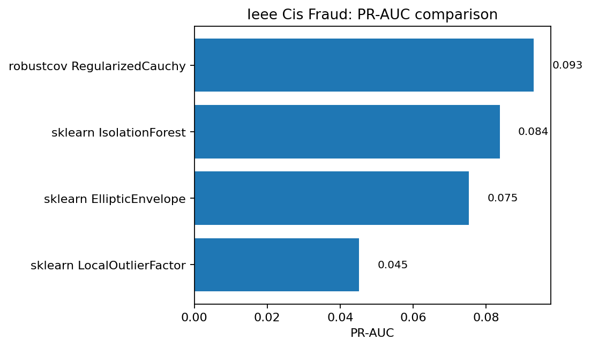
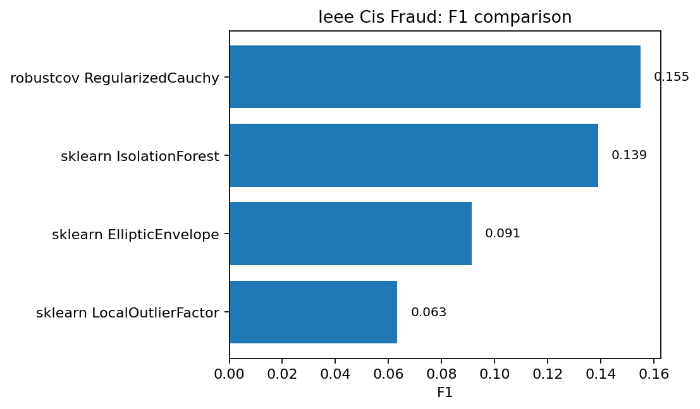
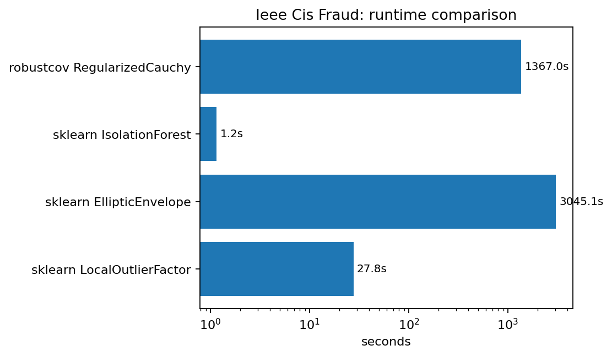

IEEE-CIS fraud
==============

Status
------

.. admonition:: Best quality among tested unsupervised baselines, but slow
   :class: warning

   ``RegularizedCauchy`` achieved the best F1, ROC-AUC, and PR-AUC among the
   tested unsupervised baselines, but it was much slower than
   ``IsolationForest``.  This should be reported as a quality/interpretability
   result, not as a speed win.

Why this is a difficult benchmark
---------------------------------

IEEE-CIS is large, heterogeneous, and contains missing values together with
mixed numeric and categorical structure.  Supervised boosting methods are often
a better fit for this setting, so the benchmark is mainly a test of how far an
unsupervised covariance score can go.

Result summary
--------------

.. list-table:: IEEE-CIS fraud external benchmark
   :header-rows: 1

   * - Method
     - F1
     - PR-AUC
     - ROC-AUC
     - Seconds
   * - robustcov RegularizedCauchy
     - 0.1550
     - 0.0931
     - 0.7641
     - 1367.0149
   * - sklearn IsolationForest
     - 0.1390
     - 0.0838
     - 0.7387
     - 1.1571
   * - sklearn EllipticEnvelope
     - 0.0914
     - 0.0753
     - 0.7578
     - 3045.0699
   * - sklearn LocalOutlierFactor
     - 0.0633
     - 0.0452
     - 0.6539
     - 27.7558

   PR-AUC comparison.  ``RegularizedCauchy`` gives the best quality among these
   unsupervised baselines, but the margin over ``IsolationForest`` is modest.

   F1 comparison at the same detection budget.

   Runtime comparison on a log scale.  The large runtime gap is the main reason
   this result is classified as ``competitive/slow`` rather than a strong win.

Console output
--------------

.. literalinclude:: ../_static/external_results/ieee_cis_fraud/output.txt
   :language: text

Quality and runtime tradeoff
----------------------------

``RegularizedCauchy`` has the best quality metrics among the methods shown, but
its runtime is far above ``IsolationForest``.  On this dataset, the robust score
is better suited to sampled analysis, model diagnostics, or use as an extra
feature in a larger fraud system.

A practical scaling path
------------------------

The next improvement for large Kaggle-style tabular data is a sampled-fit/full-
score mode, for example fitting the robust scatter on 50k representative rows
and scoring all rows.  This would preserve much of the robust-distance signal
while making the workflow much faster.
