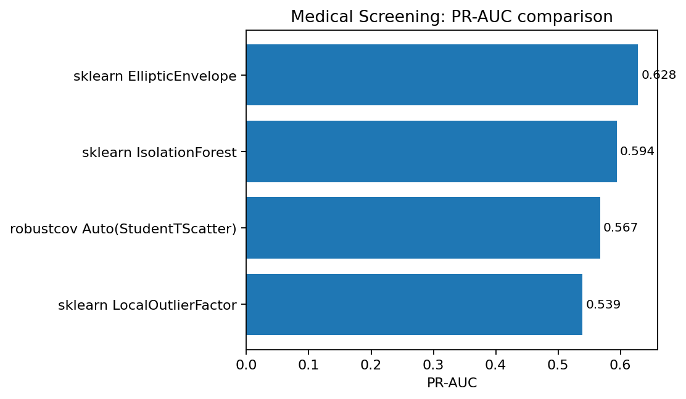
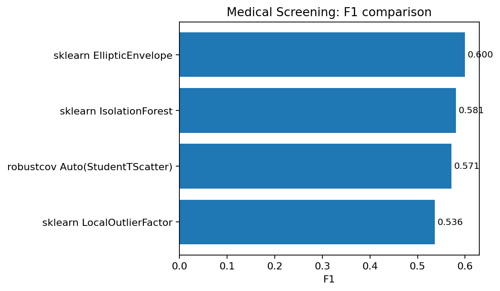
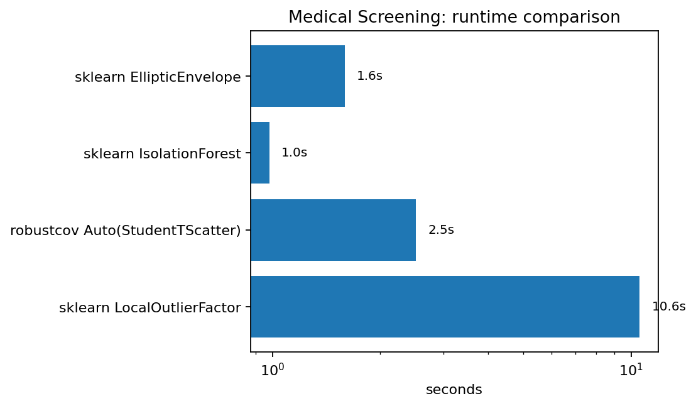

Medical screening
=================

Status
------

.. admonition:: Competitive, not best
   :class: note

   On this medical tabular screening dataset, ``robustcov`` is close to the
   tested baselines, but it is not the best method.  ``EllipticEnvelope`` gives
   the strongest F1 and PR-AUC in this run.  We keep the result because it is a
   useful negative/competitive example: robust covariance is not expected to win
   every tabular anomaly benchmark.

Dataset characteristics
-----------------------

The table contains risk factors with nonlinear effects and population-level
confounding.  A single elliptical covariance model is therefore a limited
description of the screening problem.

Result summary
--------------

.. list-table:: Medical screening external benchmark
   :header-rows: 1

   * - Method
     - F1
     - PR-AUC
     - ROC-AUC
     - Seconds
   * - sklearn EllipticEnvelope
     - 0.5996
     - 0.6285
     - 0.6356
     - 1.5929
   * - sklearn IsolationForest
     - 0.5811
     - 0.5941
     - 0.6078
     - 0.9813
   * - robustcov Auto(StudentTScatter)
     - 0.5712
     - 0.5674
     - 0.5863
     - 2.5164
   * - sklearn LocalOutlierFactor
     - 0.5365
     - 0.5391
     - 0.5487
     - 10.5699

   PR-AUC comparison.  ``robustcov`` is competitive but trails
   ``EllipticEnvelope`` and ``IsolationForest`` on this dataset.

   F1 comparison at a fixed detection budget.

   Runtime comparison on a log scale.

Console output
--------------

.. literalinclude:: ../_static/external_results/medical_screening/output.txt
   :language: text

What the comparison says
------------------------

``robustcov`` is competitive but trails two baselines.  The result suggests
that much of the class structure is not captured by one covariance geometry; a
supervised or nonlinear model may be more appropriate.

Suggested use
-------------

Use ``robustcov`` here as a diagnostic score or preprocessing feature rather
than the sole production detector.  If labels are available, evaluate the robust
score alongside supervised models.
