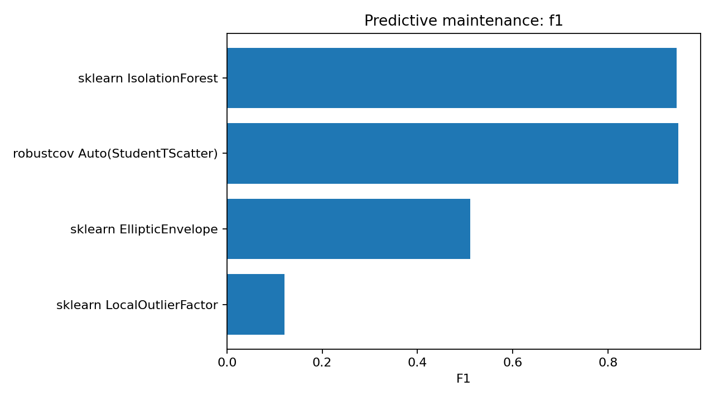
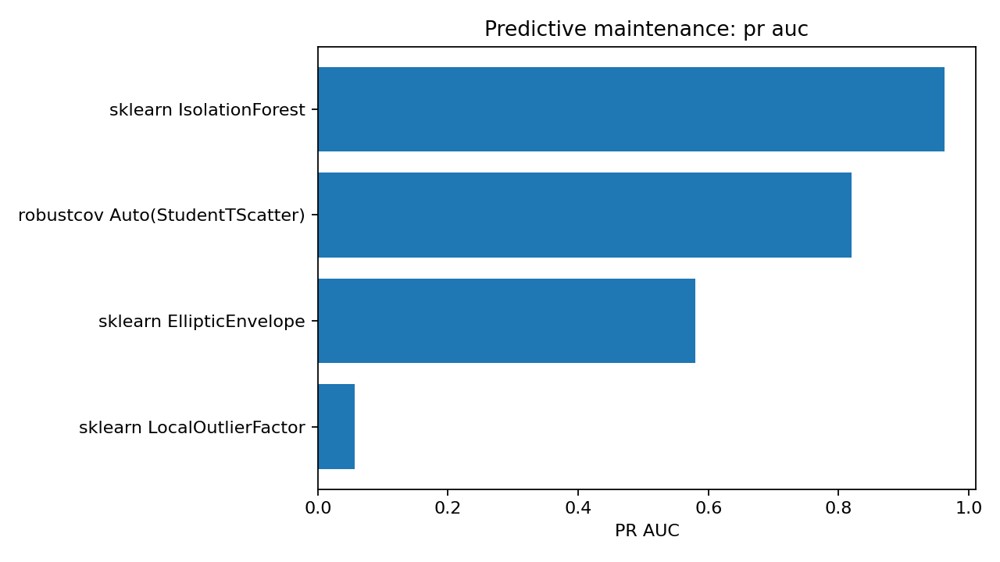
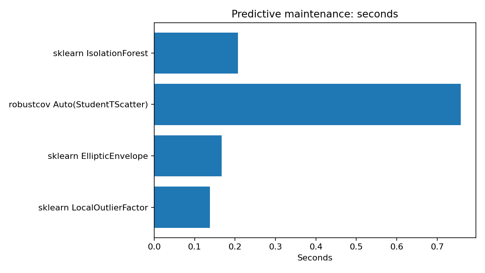

Predictive maintenance
======================

Status
------

**Competitive, not dominant.**  ``robustcov Auto(StudentTScatter)`` gives the
best F1 at the fixed detection budget, while IsolationForest has the strongest
PR-AUC and is faster.  This is a good example of honest reporting: robustcov is
useful, but it is not the only strong method for this dataset.

Problem
-------

Predictive-maintenance data usually contain sensor or process measurements and
a binary failure indicator.  The goal is to rank observations or operating
states by abnormality so that likely failures are prioritized for inspection.

Result table
------------

.. list-table:: Predictive-maintenance external result
   :header-rows: 1

   * - Method
     - Seconds
     - F1
     - ROC-AUC
     - PR-AUC
   * - sklearn IsolationForest
     - 0.2076
     - 0.9440
     - 0.9872
     - 0.9628
   * - robustcov Auto(StudentTScatter)
     - 0.7577
     - 0.9469
     - 0.9846
     - 0.8199
   * - sklearn EllipticEnvelope
     - 0.1666
     - 0.5103
     - 0.9531
     - 0.5805
   * - sklearn LocalOutlierFactor
     - 0.1379
     - 0.1209
     - 0.4843
     - 0.0570

Output from the run
-------------------

.. literalinclude:: ../_static/external_results/predictive_maintenance/output.txt
   :language: text

Plots
-----

Interpretation
--------------

At the selected detection budget, robustcov slightly improves F1 over
IsolationForest.  However, IsolationForest is faster and has substantially
higher PR-AUC.  The most honest recommendation is therefore:

* use robustcov when robust-distance interpretability or covariance-shaped
  sensor deviations are important;
* use IsolationForest as a strong default baseline;
* consider robustcov scores as additional features in a supervised maintenance
  model rather than as the only detector.
