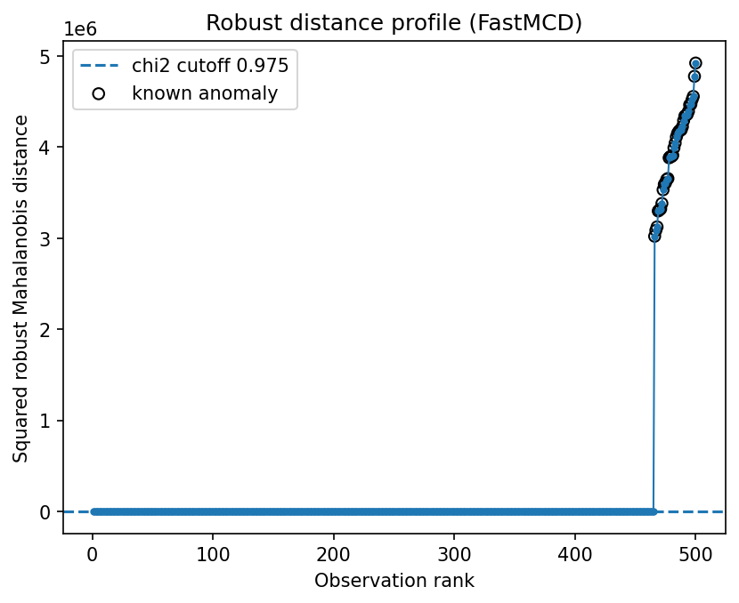

Biomedical / signal-window anomaly detection
============================================

Signal-window features often have correlated energy and shape descriptors.  Robust covariance gives a compact way to screen windows whose joint feature pattern is abnormal.

Result at a glance
------------------

The example recovers all injected abnormal windows.  The extremely large radial kurtosis is a useful warning: the distribution is far from Gaussian, so empirical or review-budget thresholds are safer than textbook chi-square thresholds.

What the data represent
-----------------------

The simulation converts signal windows into a vector of summary features.  A small number of windows are perturbed to mimic abnormal morphology or measurement artifacts.

Why this estimator
------------------

``FastMCD`` is used for the central clean-window population.  Regularized heavy-tail estimators are good alternatives when the clean signal itself is very heavy-tailed.

Reproduce the result
--------------------

.. code-block:: bash

   python examples/use_case_biomedical_signal.py

Output from the run
-------------------

.. literalinclude:: ../_static/gallery/biomedical_signal/output.txt
   :language: text

Figures and diagnostics
-----------------------

How to read the result
----------------------

The distance profile is the first diagnostic to inspect.  A small set of windows should appear clearly above the central bulk.  When radial kurtosis is enormous, focus on ranking and visual inspection rather than parametric p-values.

What this does not prove
------------------------

Medical or biomedical screening requires domain validation.  robustcov can prioritize windows for review, but it does not provide clinical labels.
