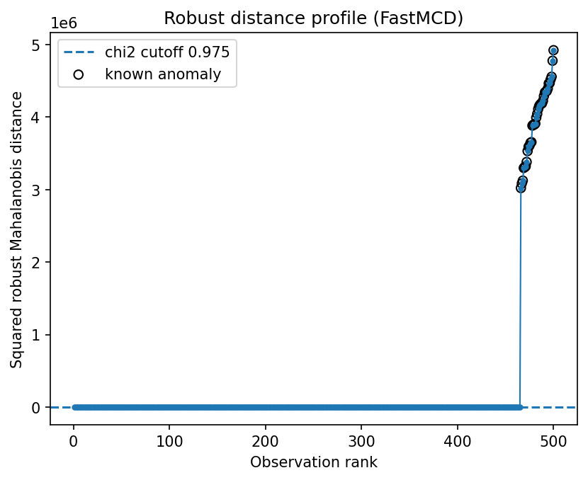

Biomedical / signal-window anomaly detection
============================================

Signal-window features often have correlated energy and shape descriptors.  Robust covariance gives a compact way to screen windows whose joint feature pattern is abnormal.

Detection result
----------------

All injected abnormal windows are recovered in this run.  Radial kurtosis is extremely large, however, so a chi-square cutoff would be difficult to justify.  A threshold based on a clean validation set or a fixed review budget is more appropriate.

Signal-window simulation
------------------------

The simulation converts signal windows into a vector of summary features.  A small number of windows are perturbed to mimic abnormal morphology or measurement artifacts.

Model choice
------------

``FastMCD`` is used for the central clean-window population.  Regularized heavy-tail estimators are good alternatives when the clean signal itself is very heavy-tailed.

Run the example
---------------

.. code-block:: bash

   python examples/use_case_biomedical_signal.py

Console output
--------------

.. literalinclude:: ../_static/gallery/biomedical_signal/output.txt
   :language: text

Distance profile
----------------

Reading the tail
----------------

The distance profile is the first diagnostic to inspect.  A small set of windows should appear clearly above the central bulk.  When radial kurtosis is enormous, focus on ranking and visual inspection rather than parametric p-values.

Clinical use
------------

The score can prioritize windows for review.  It does not assign a diagnosis, and any clinical use requires validation against domain labels and acquisition artifacts.
