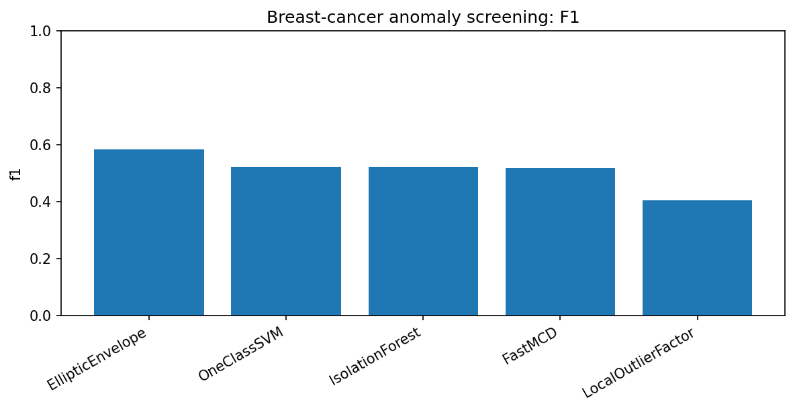
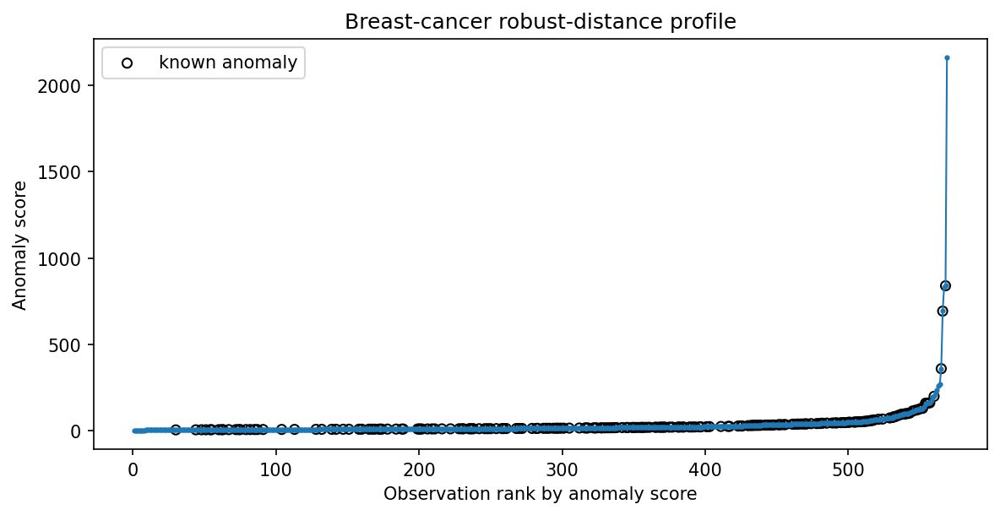
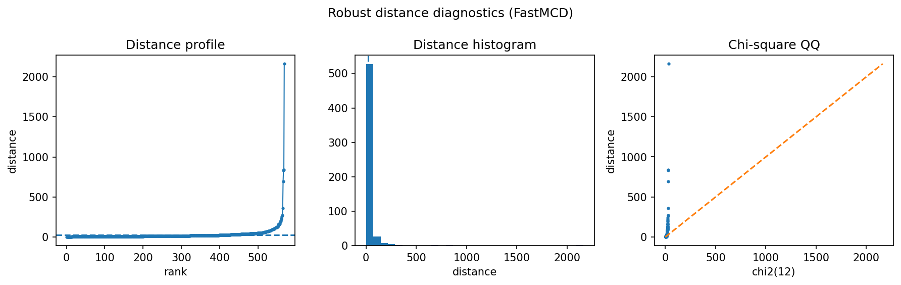

Breast-cancer screening as anomaly ranking
==========================================

This real sklearn dataset is a useful reality check.  The classes are not generated by a covariance model, so robustcov should not be expected to dominate all baselines.

Result at a glance
------------------

EllipticEnvelope has the best F1 in this run.  FastMCD is close to IsolationForest and OneClassSVM but not best.  This is a valuable honest example: robust distances are competitive diagnostics, not universal winners.

What the data represent
-----------------------

The example uses the sklearn breast-cancer dataset with a reduced feature representation.  One class is treated as the anomaly class for an unsupervised screening comparison.

Why this estimator
------------------

``FastMCD`` is included as an interpretable robust-distance baseline.  It is compared with common sklearn anomaly detectors.

Reproduce the result
--------------------

.. code-block:: bash

   python examples/use_case_breast_cancer_screening.py

Output from the run
-------------------

.. literalinclude:: ../_static/gallery/breast_cancer_screening/output.txt
   :language: text

Figures and diagnostics
-----------------------

How to read the result
----------------------

Look at both F1 and ROC-AUC.  Similar F1 values can hide different score rankings, and score rankings matter if the practical task is review prioritization.

What this does not prove
------------------------

For medical datasets, supervised clinical models and feature engineering are usually necessary.  robustcov should be framed as an interpretable screening score.
