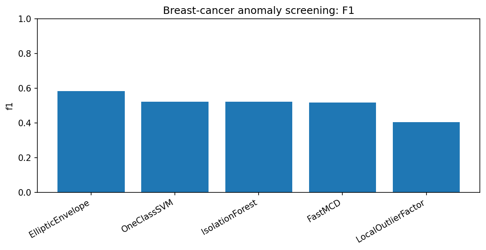
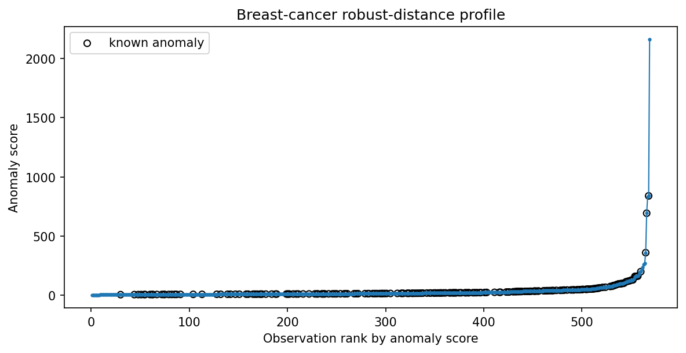
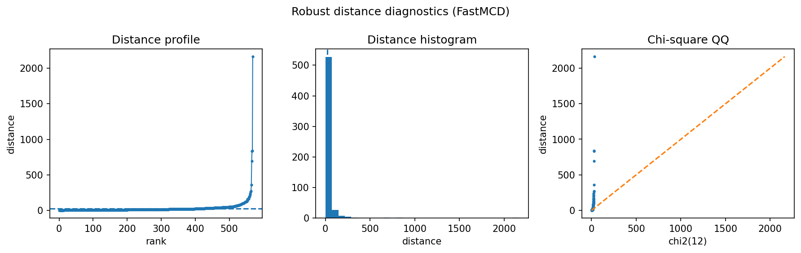

Breast-cancer screening as anomaly ranking
==========================================

This real sklearn dataset is a useful reality check.  The classes are not generated by a covariance model, so robustcov should not be expected to dominate all baselines.

Benchmark result
----------------

EllipticEnvelope has the highest F1 in this run.  FastMCD is close to IsolationForest and OneClassSVM, but it is not the leading method.  The comparison is included because covariance-based scores should be judged against standard baselines, not assumed to win.

Dataset and screening setup
---------------------------

The example uses the sklearn breast-cancer dataset with a reduced feature representation.  One class is treated as the anomaly class for an unsupervised screening comparison.

Robust baseline
---------------

``FastMCD`` is included as an interpretable robust-distance baseline.  It is compared with common sklearn anomaly detectors.

Run the comparison
------------------

.. code-block:: bash

   python examples/use_case_breast_cancer_screening.py

Console output
--------------

.. literalinclude:: ../_static/gallery/breast_cancer_screening/output.txt
   :language: text

Plots
-----

Comparing rankings
------------------

Look at both F1 and ROC-AUC.  Similar F1 values can hide different score rankings, and score rankings matter if the practical task is review prioritization.

Use in medical work
-------------------

For this kind of medical dataset, a supervised model and clinically motivated features are normally the main analysis.  Robust distance is better treated as an interpretable screening or quality-control score.
