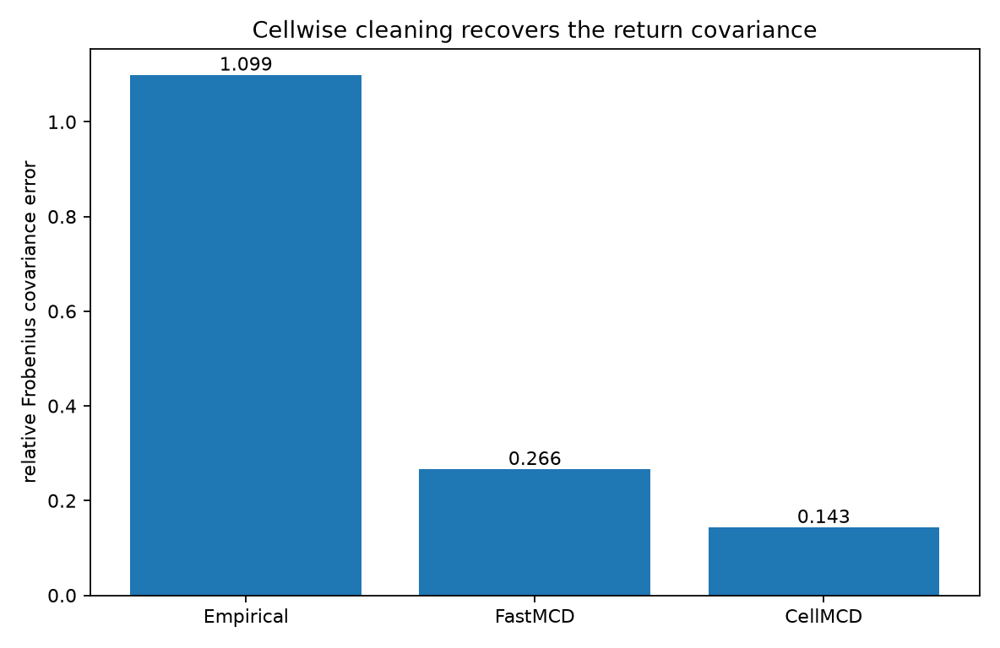
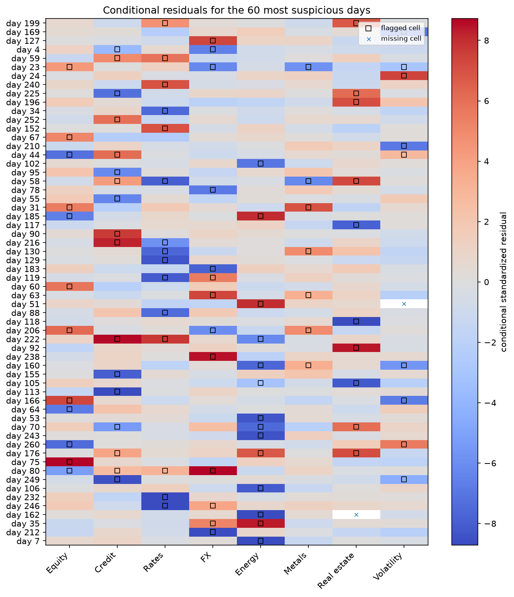
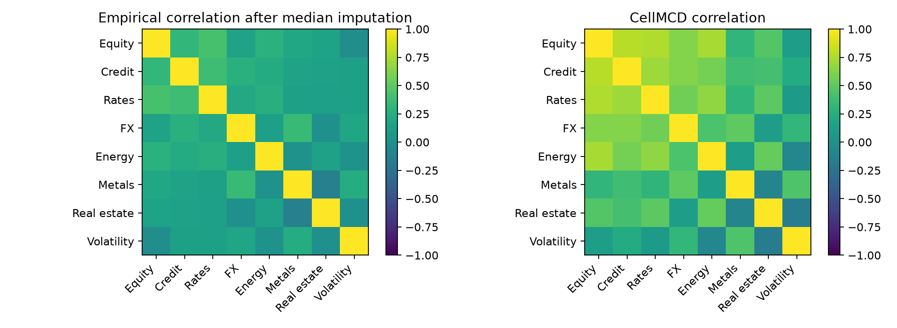

CellMCD for isolated bad ticks
==============================

The data in this example are synthetic daily returns for eight assets.  Nine
percent of the individual cells are replaced by large positive or negative
moves, and another two percent are missing.  Because the bad cells are spread
across the table, more than half of the rows contain at least one corrupted
entry.

A rowwise method must decide whether to keep or discard each whole day.
``CellMCD`` instead predicts and flags individual asset-day cells while retaining
the other returns from the same day.

Run the example
---------------

.. code-block:: bash

   python examples/plot_cellmcd_market_data.py

.. literalinclude:: ../_static/gallery/cellmcd_market_data/output.txt
   :language: text
   :caption: Console output

Covariance recovery
-------------------

The empirical estimate is calculated after median imputation.  ``FastMCD`` can
discard contaminated rows, but in this simulation the row contamination rate is
above one half.  CellMCD uses the clean entries that remain within those rows.

Conditional residual map
------------------------

The map shows the 60 days with the largest cellwise residual.  The color is the
conditional standardized residual for each asset.  Black boxes mark cells
flagged by CellMCD, and crosses mark originally missing cells.

Correlation structure
---------------------

A few large bad ticks can visibly distort empirical correlations.  The CellMCD
estimate is calculated after integrating cell detection into the covariance fit.

Scope
-----

The example uses a Gaussian factor model so the clean covariance is known and
can be scored directly.  Real returns are heavier-tailed and time dependent;
the example is about isolated data errors, not a complete market-risk model.

Source
------

.. literalinclude:: ../../examples/plot_cellmcd_market_data.py
   :language: python
   :caption: examples/plot_cellmcd_market_data.py
