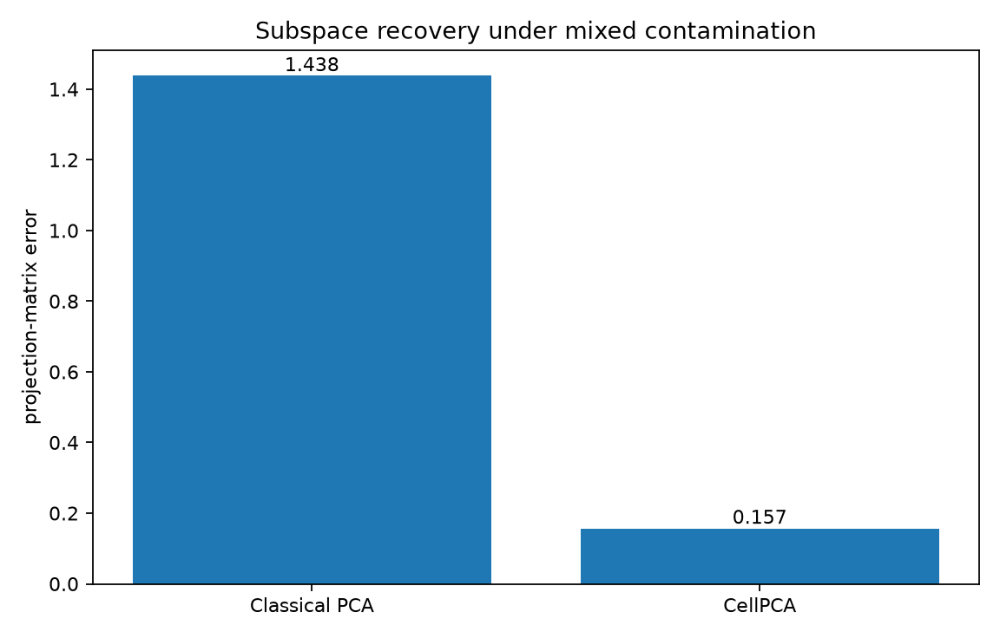
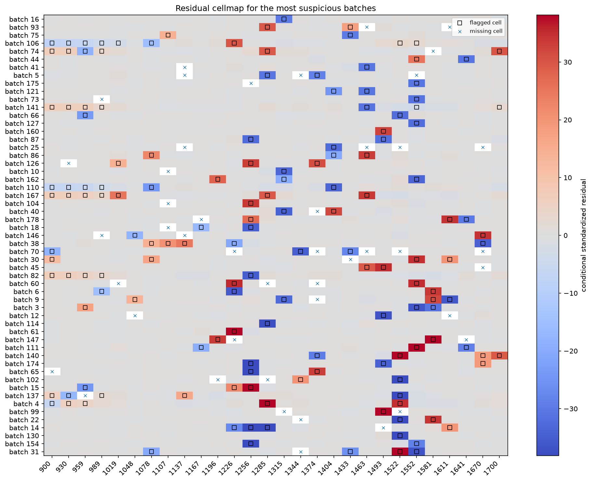
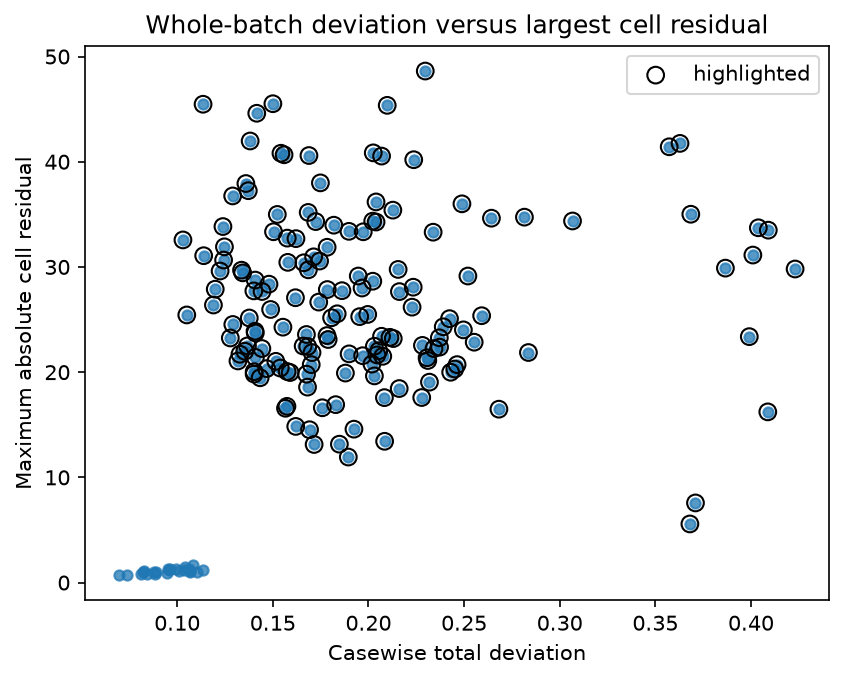
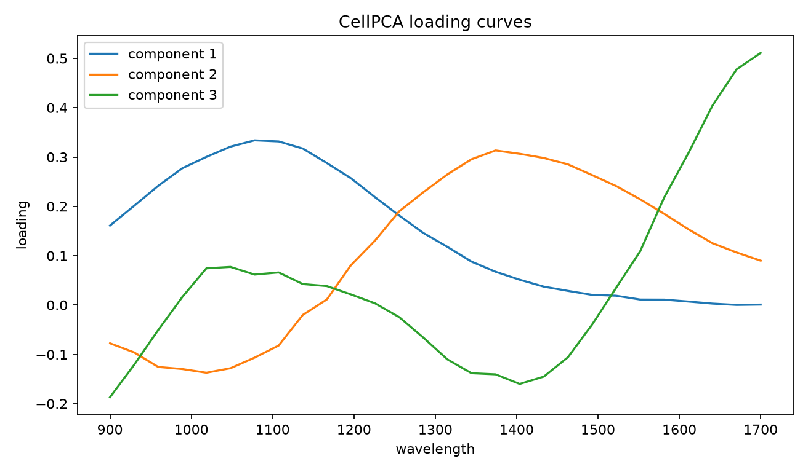

CellPCA for process spectra
===========================

Each row in this synthetic dataset is a low-resolution process spectrum.  The
clean spectra follow three smooth latent factors.  The observed table also
contains isolated wavelength errors, twelve abnormal batches, and missing
measurements.

Classical PCA is fitted after column-median imputation.  ``CellPCA`` uses the
observed cells directly and assigns separate weights to cells and complete
rows.

Run the example
---------------

.. code-block:: bash

   python examples/plot_cellpca_process_spectra.py

.. literalinclude:: ../_static/gallery/cellpca_process_spectra/output.txt
   :language: text
   :caption: Console output

Subspace recovery
-----------------

The projection-matrix error compares the estimated three-dimensional subspace
with the known clean subspace.  Large cell errors rotate ordinary PCA even
though most entries remain usable.

Residual cellmap
----------------

The cellmap contains the 55 rows with the largest standardized cell residual.
Outlined cells are flagged by the fitted model; crosses denote missing
measurements.  A localized vertical feature points to a problematic wavelength,
whereas a broad pattern across a row is more consistent with an abnormal batch.

Two types of outlyingness
-------------------------

The horizontal axis summarizes the complete row's departure from the subspace.
The vertical axis records its largest absolute cell residual.  Highlighted rows
contain an injected cell error, an abnormal batch effect, or both.

Loading curves
--------------

The estimated loading vectors retain the smooth structure used to generate the
clean spectra.

Scope
-----

The simulation has a known low-rank Gaussian signal so recovery and imputation
can be measured directly.  Real spectra may require preprocessing for baseline,
scatter, and wavelength alignment before any PCA method is appropriate.

Source
------

.. literalinclude:: ../../examples/plot_cellpca_process_spectra.py
   :language: python
   :caption: examples/plot_cellpca_process_spectra.py
