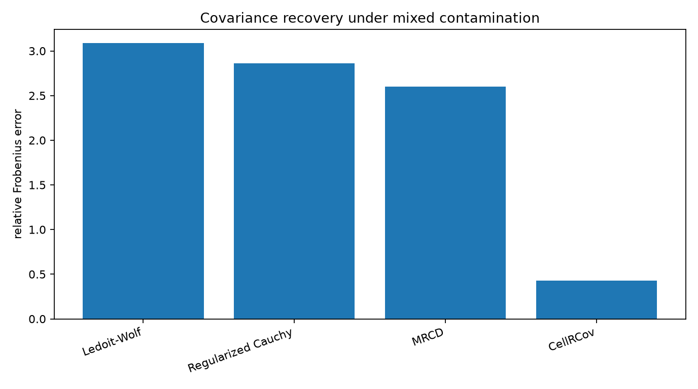
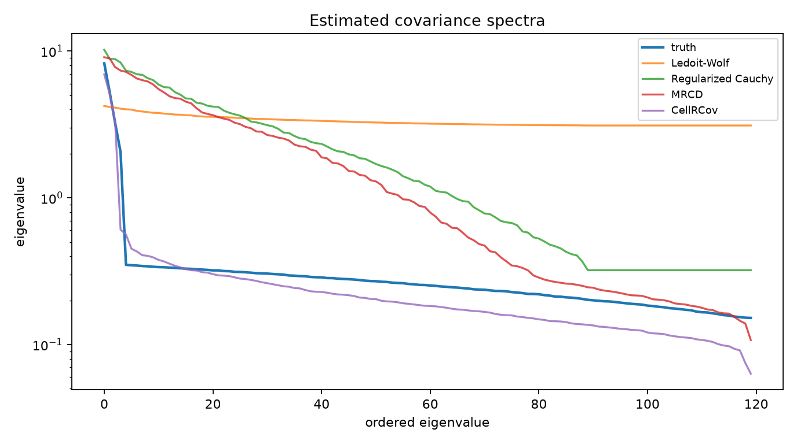
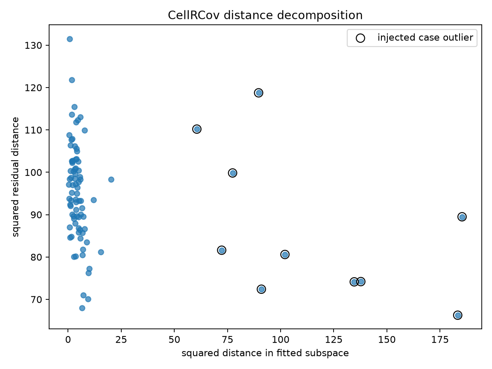
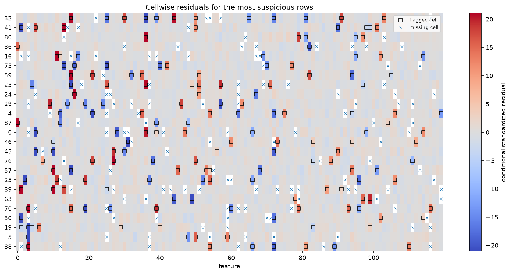

CellRCov in a high-dimensional contaminated table
==================================================

This synthetic example has 90 observations and 120 variables.  The clean
covariance contains four dominant factors plus heteroscedastic residual
variation.  The observed table contains isolated bad cells, a minority of rows
shifted outside the factor subspace, and missing entries.

Run the example
---------------

.. code-block:: bash

   python examples/plot_cellrcov_high_dimensional.py

.. literalinclude:: ../_static/gallery/cellrcov_high_dimensional/output.txt
   :language: text
   :caption: Console output

Covariance recovery
-------------------

Ledoit-Wolf, regularized Cauchy scatter, and MRCD are fitted after or with
median imputation.  CellRCov uses the individual observed cells, a robust
low-rank fit, and a regularized residual covariance.

Covariance spectrum
-------------------

The spectrum plot shows whether the dominant factors and residual eigenvalues
are recovered at the same time.  The vertical scale is logarithmic.

Subspace and residual distances
-------------------------------

CellRCov keeps the distance inside the robust fitted subspace separate from the
residual distance outside it.  The outlined points are the injected complete-row
outliers.

Cell residuals
--------------

The cellmap shows the rows with the largest standardized cell residuals.  A
single isolated mark is interpreted differently from a broad departure across
many variables.

Scope
-----

The simulation is deliberately favorable to a low-rank-plus-residual covariance
decomposition, and the true rank is supplied to every CellRCov fit.  The result
does not establish that the same rank or estimator is optimal for arbitrary
high-dimensional tables.

Source
------

.. literalinclude:: ../../examples/plot_cellrcov_high_dimensional.py
   :language: python
   :caption: examples/plot_cellrcov_high_dimensional.py
