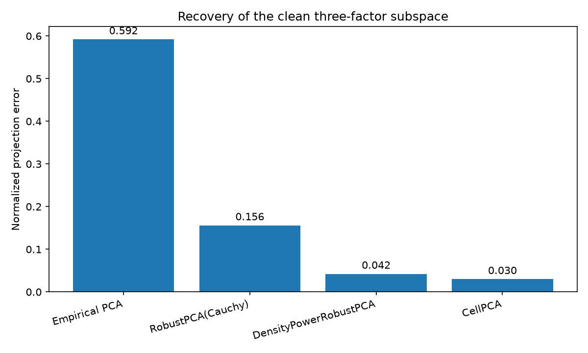
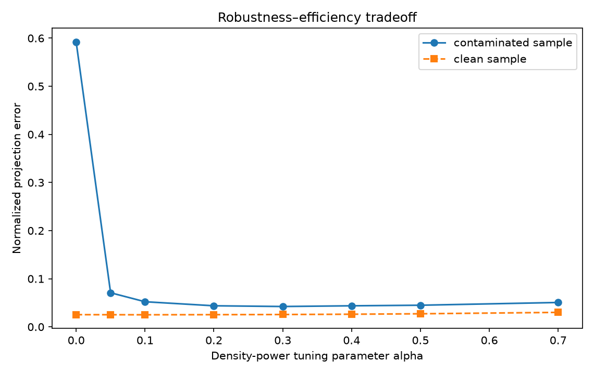
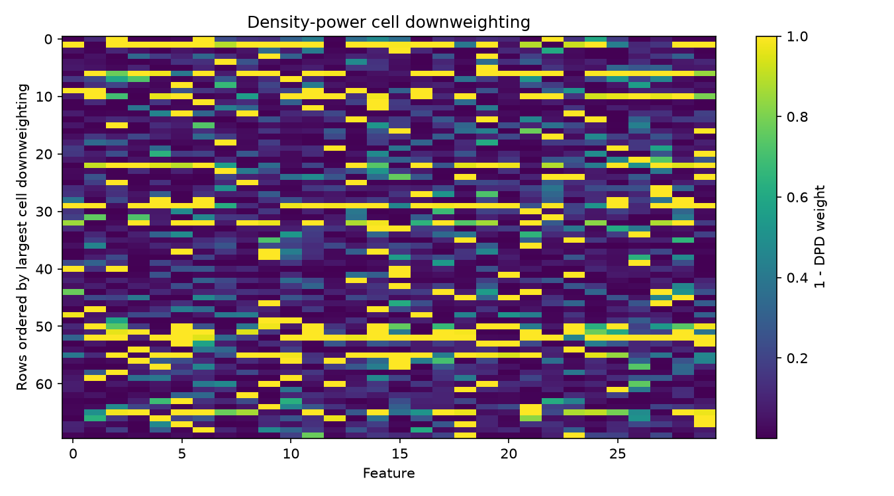
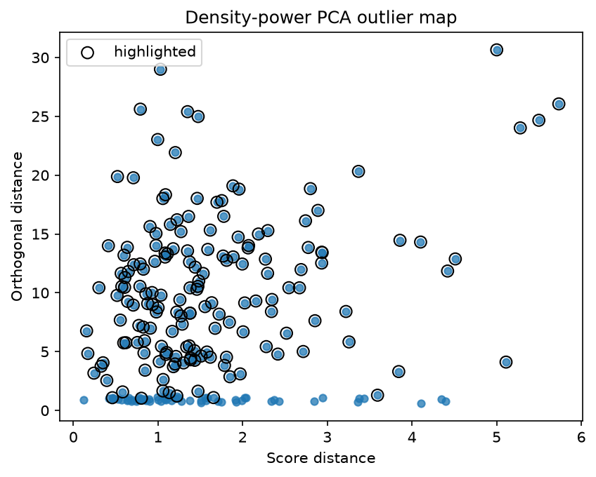

:orphan:

Density-power PCA under mixed contamination
===========================================

The simulated data follow a three-factor model with structured loading blocks.
A small fraction of individual cells receive large errors, and a separate group
of complete rows moves outside the clean factor subspace.

``DensityPowerRobustPCA`` is compared with ordinary PCA, scatter-based robust
PCA using a Cauchy estimator, and ``CellPCA``.  The purpose is not to establish a
single winner.  The example shows where a direct density-power low-rank fit sits
between scatter PCA and a fully cellwise/casewise model.

.. literalinclude:: ../../examples/plot_density_power_pca.py
   :language: python
   :linenos:

Observed output
---------------

.. literalinclude:: ../_static/gallery/density_power_pca/output.txt
   :language: text

Subspace recovery
-----------------

Ordinary PCA rotates toward the large corrupted entries.  The density-power fit
recovers the clean subspace closely in this simulation.  ``CellPCA`` remains the
more specialized choice when cellwise and casewise contamination must be
modeled explicitly.

Tuning alpha
------------

At :math:`\alpha=0`, the method reduces to least-squares PCA and performs best
on the clean sample.  Moderate positive values protect the contaminated fit.
Large values can sacrifice efficiency without adding useful robustness.

Cell downweighting
------------------

The weights are generated by the reconstruction residuals.  They identify the
large injected errors well here, but they should not be interpreted as formal
posterior probabilities of contamination.

Outlier map
-----------

Rows containing isolated bad cells and rows displaced outside the clean factor
space generally have large orthogonal distance.  Score distance remains useful
for rows that are extreme while still aligned with the fitted factors.
