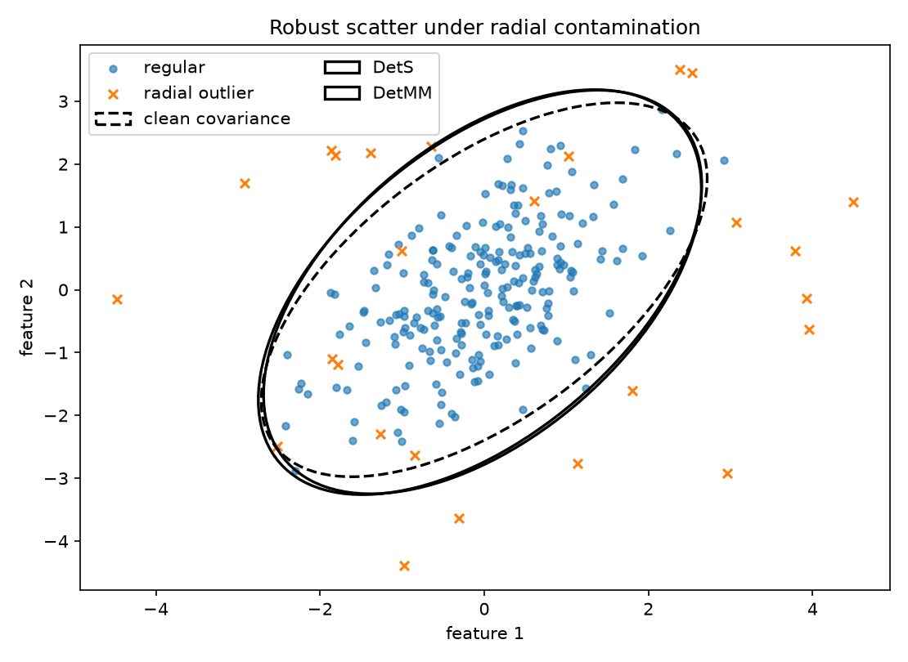
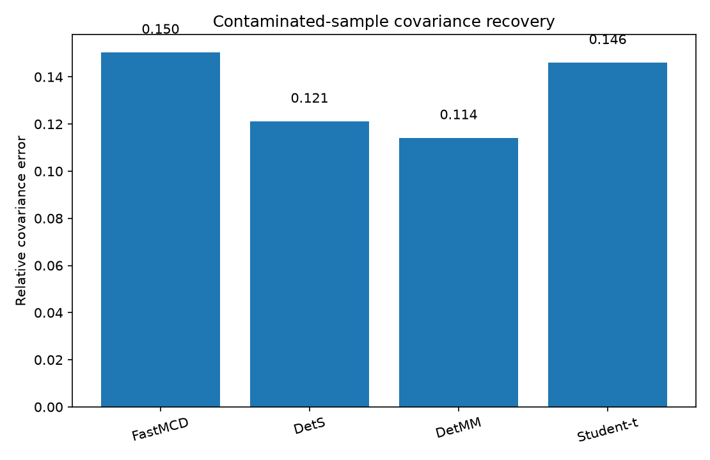
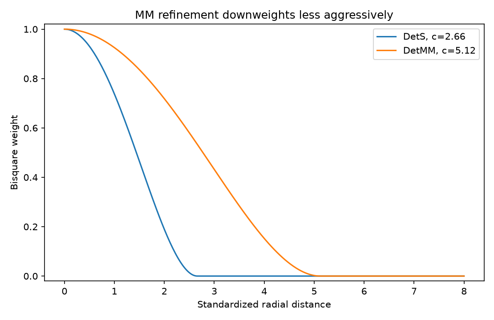
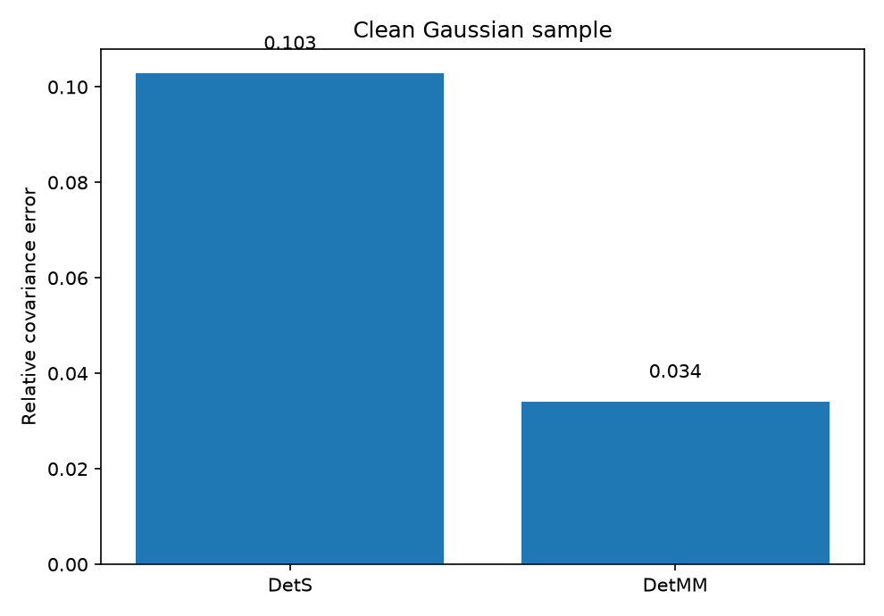

:orphan:

DetS and DetMM: robustness versus efficiency
=============================================

The data contain correlated Gaussian observations and a small set of radial
outliers.  ``DetS`` uses a high-breakdown bisquare S-scale.  ``DetMM`` starts
from that fit, keeps its scale, and estimates location and shape with a larger
bisquare cutoff calibrated to 95% nominal location efficiency.

.. literalinclude:: ../../examples/plot_dets_detmm_tradeoff.py
   :language: python
   :linenos:

Observed output
---------------

.. literalinclude:: ../_static/gallery/dets_detmm_tradeoff/output.txt
   :language: text

Robust scatter fits
-------------------

The two fitted ellipses remain centered on the main cloud.  Unlike a hard MCD
support, both estimators assign continuous weights to observations inside their
bisquare cutoff.

Covariance recovery
-------------------

The simulation is chosen to show a regime where smooth S/MM weighting is
competitive.  A separated outlier cluster can favor FastMCD, while diffuse
heavy tails can favor Student-t or Cauchy weighting.

Weight functions
----------------

The larger MM cutoff retains more information from moderately distant clean
observations.  Very distant observations still receive zero weight.

Clean-sample behavior
---------------------

The single clean sample illustrates the purpose of the MM step; it is not an
estimate of asymptotic efficiency.  Repeated simulation is needed for a stable
empirical efficiency comparison.
