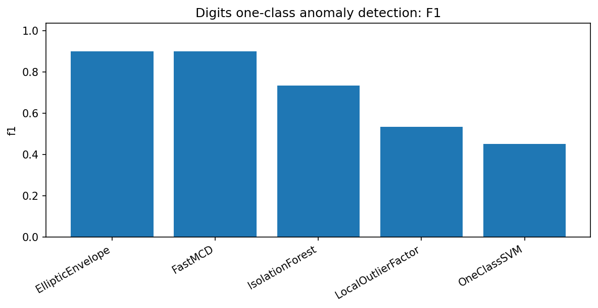
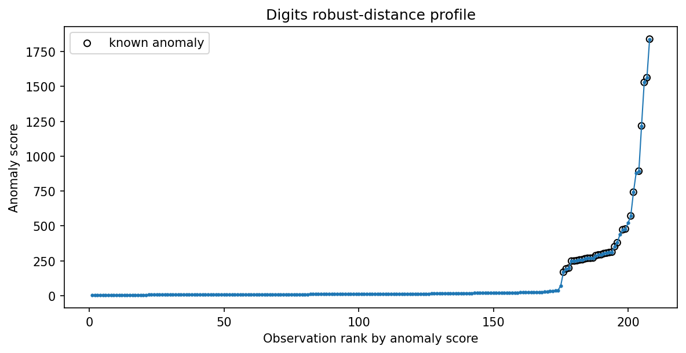

Digits one-class anomaly detection
==================================

The digits example is intentionally visual and easy to understand: train on one digit and treat another digit as the anomaly.  It is a compact test of one-class feature geometry.

Result at a glance
------------------

FastMCD ties EllipticEnvelope at F1=0.900 and has ROC-AUC around 0.987.  IsolationForest, LOF, and OneClassSVM are lower in this setup.

What the data represent
-----------------------

The example uses sklearn digits features with digit 0 as the normal class and digit 1 as the anomaly class in the captured run.

Why this estimator
------------------

``FastMCD`` is appropriate because the normal digit features form a compact central group after preprocessing.

Reproduce the result
--------------------

.. code-block:: bash

   python examples/use_case_digits_one_class_baselines.py

Output from the run
-------------------

.. literalinclude:: ../_static/gallery/digits_one_class/output.txt
   :language: text

Figures and diagnostics
-----------------------

.. image:: ../_static/gallery/digits_one_class/distance_panel.png
   :alt: Digits one-class anomaly detection — distance panel
   :width: 760px

How to read the result
----------------------

The score profile shows whether anomaly digits are concentrated at the top of the robust-distance ranking.  This is often more informative than a single threshold.

What this does not prove
------------------------

If several digits or styles are valid normal data, a cluster-aware detector is usually more appropriate than one global covariance model.
