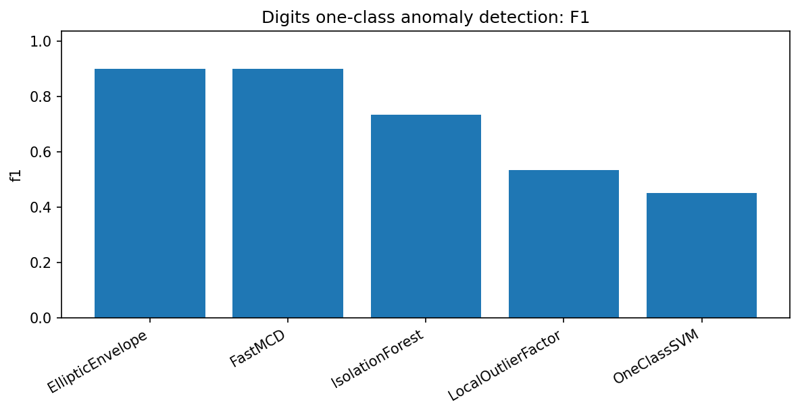
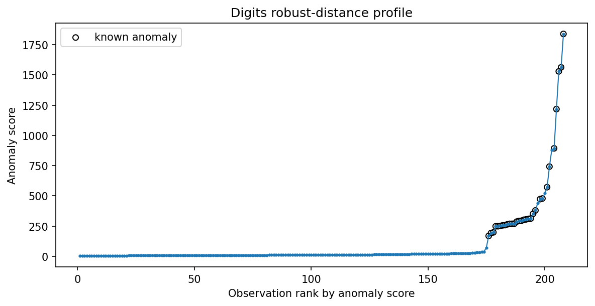

Digits one-class anomaly detection
==================================

Train on one handwritten digit, then ask whether a different digit rises to the top of the anomaly ranking.  The setup gives a compact visual check of one-class feature geometry.

Results
-------

FastMCD ties EllipticEnvelope at F1=0.900 and has ROC-AUC around 0.987.  IsolationForest, LOF, and OneClassSVM are lower in this setup.

One-class setup
---------------

The example uses sklearn digits features with digit 0 as the normal class and digit 1 as the anomaly class in the captured run.

Why FastMCD fits this setup
---------------------------

``FastMCD`` is appropriate because the normal digit features form a compact central group after preprocessing.

Run the example
---------------

.. code-block:: bash

   python examples/use_case_digits_one_class_baselines.py

Console output
--------------

.. literalinclude:: ../_static/gallery/digits_one_class/output.txt
   :language: text

Plots
-----

.. image:: ../_static/gallery/digits_one_class/distance_panel.png
   :alt: Digits one-class anomaly detection — distance panel
   :width: 760px

Ranking the anomaly digit
-------------------------

The score profile shows whether the held-out digit is concentrated near the top of the ranking.  That ranking remains useful even when the final threshold is chosen later from a review budget.

When one covariance is not enough
---------------------------------

If several digits or styles are valid normal data, a cluster-aware detector is usually more appropriate than one global covariance model.
