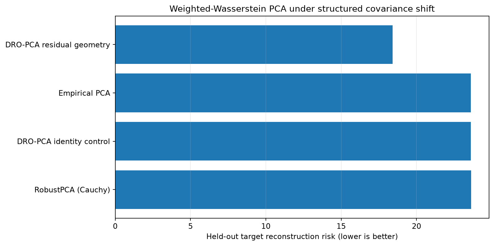
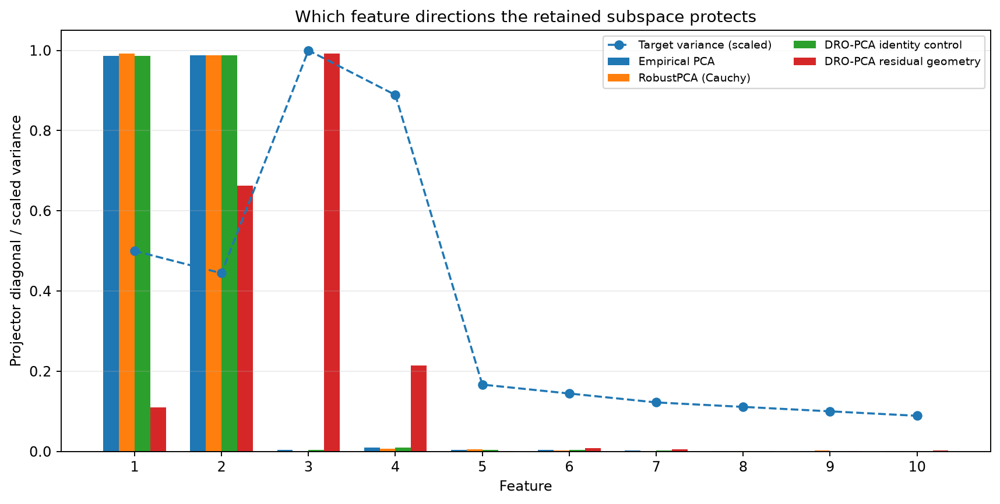
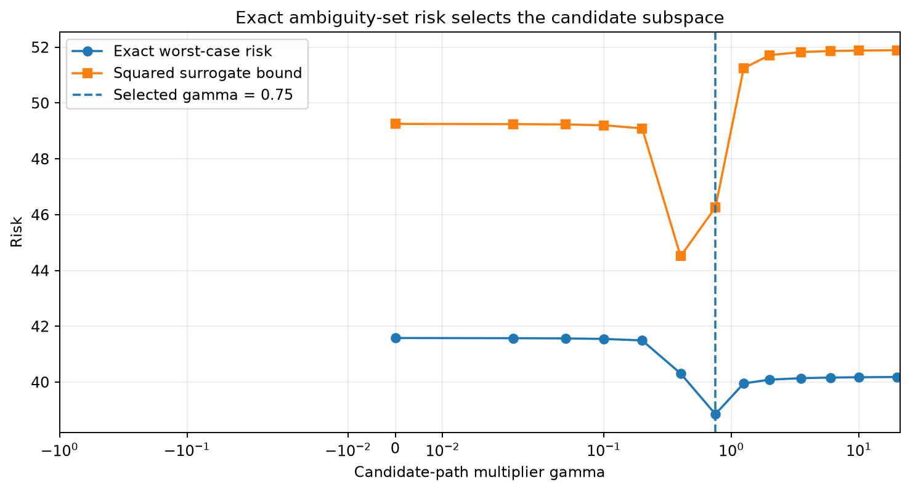

:orphan:

Distributionally robust PCA under covariance shift
===================================================

This example asks a different question from contamination-robust PCA: which
rank-two subspace performs well when the deployment covariance differs from the
training covariance in a structured way?

The training distribution has its largest variances in features 1 and 2.  The
held-out target distribution increases uncertainty in features 3 and 4.  The
anisotropic weighted-Wasserstein geometry allows the exact worst-case risk to
select a subspace that protects those plausible shift directions.

Run the example
---------------

.. code-block:: bash

   python examples/distributionally_robust_pca.py

Held-out target risk
--------------------

   The identity-geometry control matches empirical PCA.  The anisotropic
   residual geometry can reduce target risk when the assumed shift geometry is
   aligned with the deployment change.

Subspace allocation
-------------------

   Projector diagonal entries show how much of each feature direction is
   retained.  The target variance line is scaled only for visual comparison.

Exact ambiguity-set risk
------------------------

   ``formulation="exact"`` selects the path candidate with the smallest exact
   scalar-dual worst-case risk.  The displayed surrogate remains an upper-bound
   diagnostic rather than a hidden replacement objective.

Captured output
---------------

.. literalinclude:: ../_static/gallery/distributionally_robust_pca/output.txt
   :language: text

Interpretation limits
---------------------

This is a deterministic synthetic shift aligned with the chosen transport
geometry.  It demonstrates the estimator's mathematical role; it does not show
universal superiority.  The benchmark suite also includes no-shift,
contamination-only, and misspecification controls.

Source
------

.. literalinclude:: ../../examples/distributionally_robust_pca.py
   :language: python
   :linenos:
