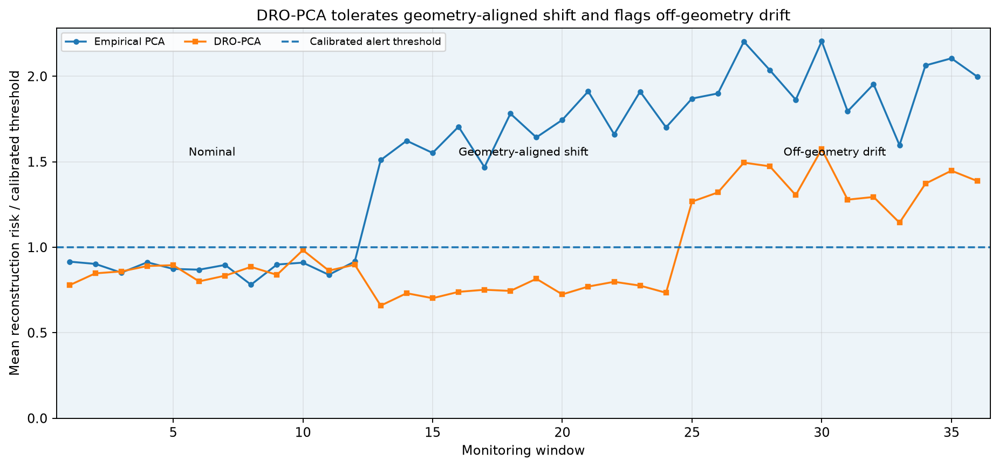
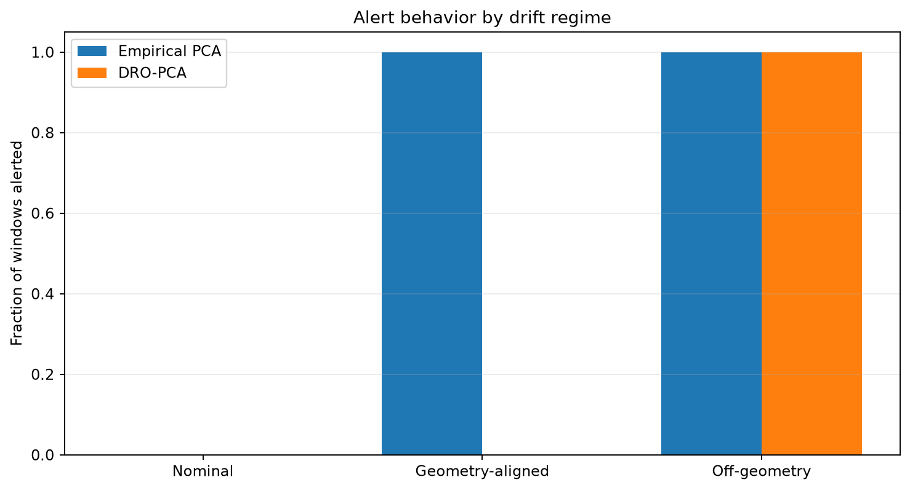
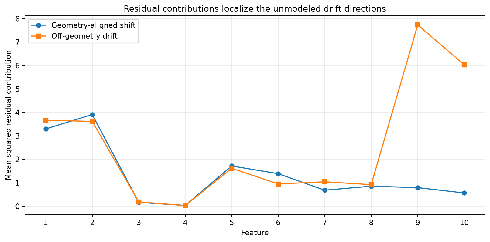

:orphan:

Distributionally robust PCA for data-drift monitoring
=====================================================

This example uses experimental ``DistributionallyRobustPCA`` as the reference
subspace in a windowed data-drift monitor.  The estimator and the detector play
different roles:

* DRO-PCA chooses a subspace that is deliberately tolerant of a stated
  weighted-Wasserstein shift geometry.
* Independent calibration windows determine the alert threshold for mean
  reconstruction risk.

The exact Wasserstein worst-case risk is retained as a model diagnostic.  It is
an expected-risk quantity, not a per-window hypothesis-test threshold.

Run the example
---------------

.. code-block:: bash

   python examples/distributionally_robust_pca_drift_monitoring.py

Monitoring timeline
-------------------

   Scores are divided by independently calibrated window thresholds.  Ordinary
   PCA treats the geometry-aligned covariance change as drift.  The DRO
   reference subspace tolerates that anticipated shift but still responds to
   the later off-geometry change.

Alert rates by regime
---------------------

   This synthetic example separates false alarms on an anticipated covariance
   change from detection of an unmodeled shift.  It is not a universal
   performance claim.

Drift localization
------------------

   Window-averaged squared residuals provide a simple localization diagnostic.
   The off-geometry regime increases residual contributions in directions that
   were not protected by the fitted transport geometry.

Monitoring contract
-------------------

The workflow calibrates the upper order statistic of **window mean
reconstruction risk** on independent nominal windows.  This controls the
reference-window alert frequency under the example's exchangeable calibration
setup.  It does not prove that every future distribution inside the Wasserstein
ball will remain below the alert threshold.

Use the workflow when:

* a plausible or acceptable shift geometry can be stated before deployment;
* the objective is to avoid alerting on that anticipated shift while detecting
  changes outside it; and
* alert thresholds can be calibrated on representative nominal windows.

For general multivariate two-sample testing, concept drift, or nonlinear
representation drift, combine this monitor with complementary diagnostics such
as robust feature geometry, MMD, output-distribution checks, or labelled
performance monitoring.

Captured output
---------------

.. literalinclude:: ../_static/gallery/distributionally_robust_pca_drift_monitoring/output.txt
   :language: text

Source
------

.. literalinclude:: ../../examples/distributionally_robust_pca_drift_monitoring.py
   :language: python
   :linenos:
