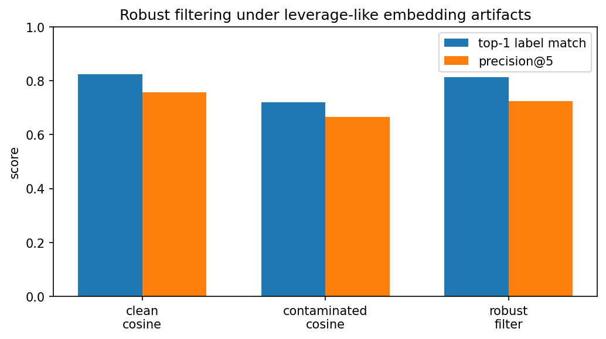
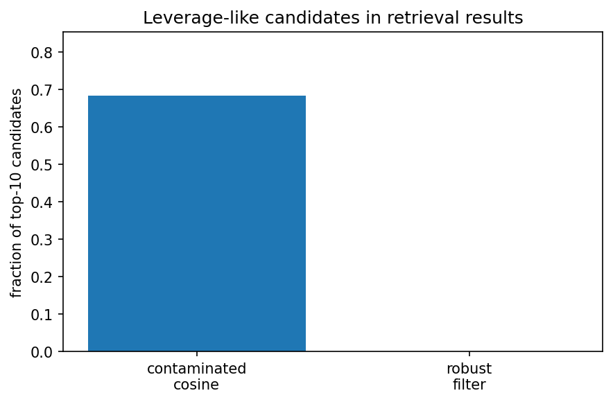

Robust embedding retrieval / RAG filtering
==========================================

Modern retrieval and RAG systems often use embedding similarity to rank
candidate documents. Cosine similarity is a strong default, but embedding spaces
can contain anisotropic or leverage-like directions. A small number of abnormal
directions can distort nearest-neighbor rankings.

This example uses the real 20 Newsgroups text dataset. Documents are embedded
with TF-IDF followed by truncated SVD. A controlled leverage-like artifact is
then injected into part of the reference embedding set.

The experiment compares:

* clean cosine retrieval;
* contaminated cosine retrieval;
* cosine retrieval with robust leverage filtering.

The goal is not to replace semantic embedding models. The goal is to show how
robust covariance geometry can act as a second-stage filter when embedding
directions contain leverage-like artifacts.

Retrieval pattern
-----------------

This example demonstrates a practical retrieval pattern:

1. use a standard semantic retriever to get candidates;
2. fit a robust scatter model on the reference embeddings;
3. identify leverage-like candidates under the robust geometry;
4. filter those candidates;
5. rank the remaining candidates by cosine similarity.

Run the example
---------------

.. code-block:: bash

   python examples/embedding_reranking_robust_geometry.py

Output
------

.. literalinclude:: ../_static/gallery/embedding_reranking_robust_geometry_output.txt
   :language: text

Interpretation
--------------

In this run, the leverage artifact substantially harms contaminated cosine
retrieval. The robust leverage filter removes all injected artifact references
while filtering only a smaller fraction of ordinary references. As a result,
retrieval quality moves back toward the clean-cosine baseline and the fraction
of leverage-like candidates in the top-10 drops to zero.

Visual summary
--------------

Why geometry helps
------------------

A robust scatter estimate defines a robust precision matrix. Given a reference
embedding ``x`` and robust location ``mu``, the robust leverage score is

.. math::

   h_R(x)
   =
   (x-\mu)^\top \widehat{\Sigma}_R^{-1} (x-\mu).

Large values indicate candidates that are unusual under the robust reference
geometry. In this example, those candidates are filtered after first-stage
cosine retrieval.

This pattern is useful when embedding coordinates contain outlier directions,
batch artifacts, sensor-like faults, or heavy-tailed variation. It is especially
relevant for RAG-style systems, multimodal retrieval, and embedding search.

Source excerpt
--------------

.. literalinclude:: ../../examples/embedding_reranking_robust_geometry.py
   :language: python
   :start-after: def main():
   :end-before: if __name__ == "__main__":
   :dedent: 4
