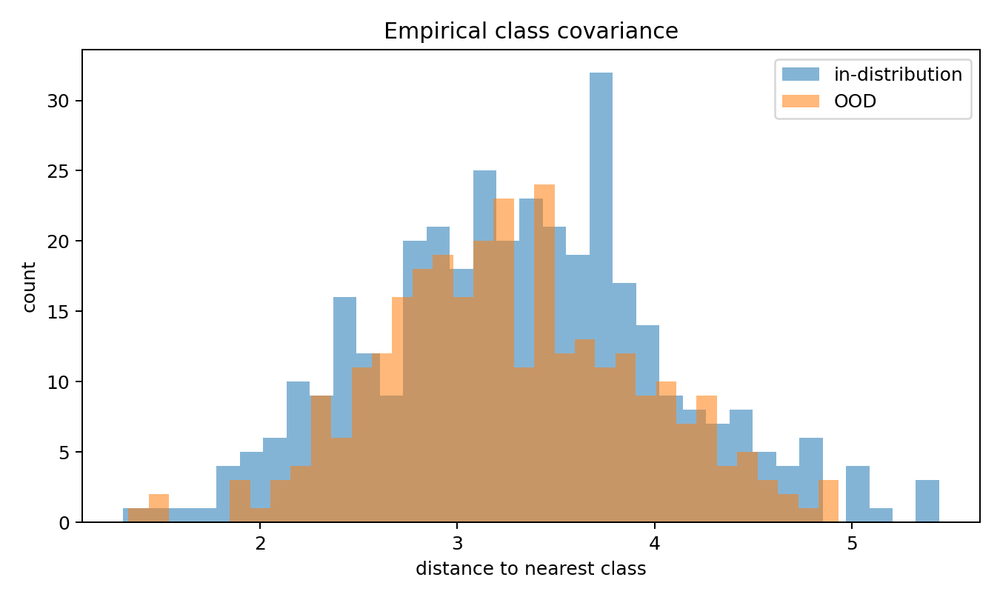
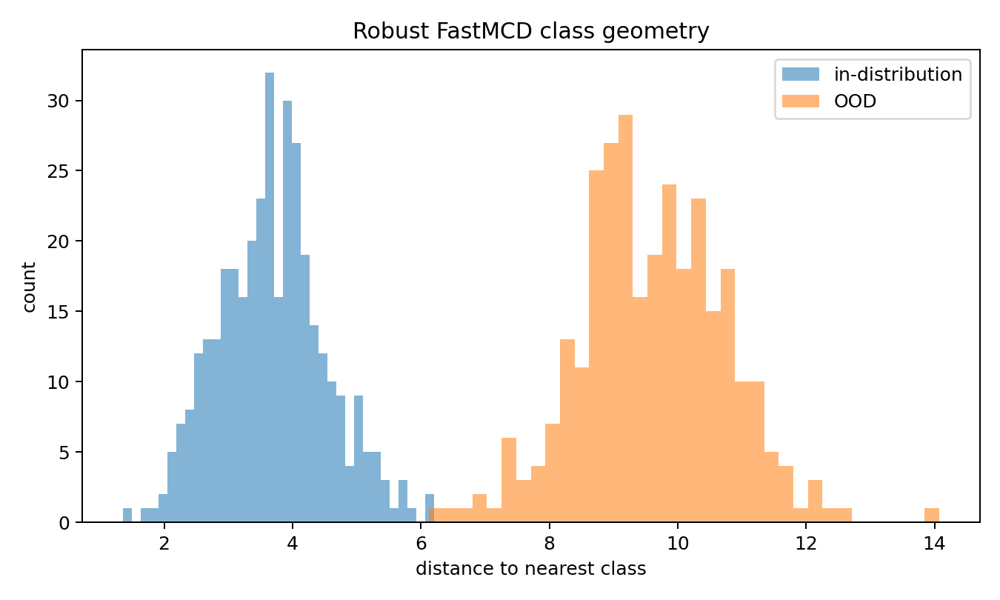
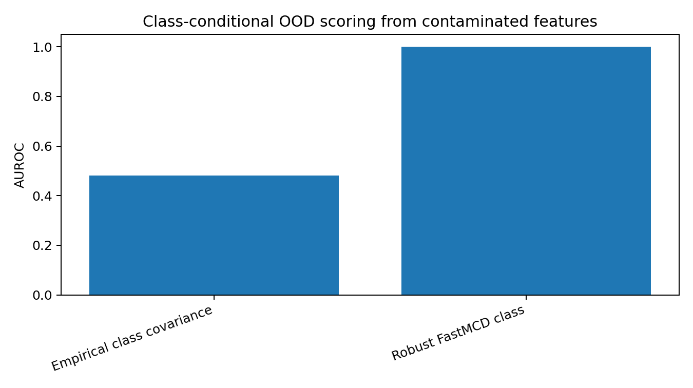

:orphan:

Class-conditional robust feature geometry
=========================================

This example shows how ``robustcov`` can be used for class-conditional
Mahalanobis-style OOD scoring on learned feature vectors.

The package does not train a neural network in this example.  It starts from a
labeled feature matrix, as if the features had already been produced by a frozen
image model, text encoder, autoencoder, or penultimate neural-network layer.

The example is intentionally synthetic.  It illustrates one specific failure
mode:

* each class reference set contains leverage-like contaminated features;
* empirical class covariance inflates variance in the contaminated direction;
* distance-to-nearest-class OOD scores become weak;
* robust class-conditional scatter geometry estimates each central class shape
  more stably.

Run the example
---------------

.. code-block:: bash

   python examples/feature_geometry_class_conditional_ood.py

Captured output
---------------

.. literalinclude:: ../_static/gallery/feature_geometry_class_conditional_ood_output.txt
   :language: text

Score distributions
-------------------

Empirical class covariance
~~~~~~~~~~~~~~~~~~~~~~~~~~

Robust FastMCD class geometry
~~~~~~~~~~~~~~~~~~~~~~~~~~~~~

AUROC summary
-------------

Interpretation
--------------

The OOD score is the distance from each test feature to its nearest fitted class
geometry.  This is the same broad idea as class-conditional Mahalanobis scoring
on learned representations, but here the class geometry can be fitted with a
robust scatter estimator.

In the synthetic setup, each class has a small fraction of leverage-like
contaminated reference features.  Empirical covariance absorbs those points by
inflating the class covariance in the contaminated direction.  As a result,
nearest-class distances become weak OOD scores.

Robust class-conditional geometry is less affected by those leverage points.
The fitted class shapes remain closer to the central feature clouds, and the
distance-to-nearest-class score separates the shifted OOD features more clearly.

This should be read as a diagnostic example, not as a universal OOD benchmark.
It illustrates how ``robustcov`` can serve as a robust geometry layer for
labeled feature matrices produced by representation models.
