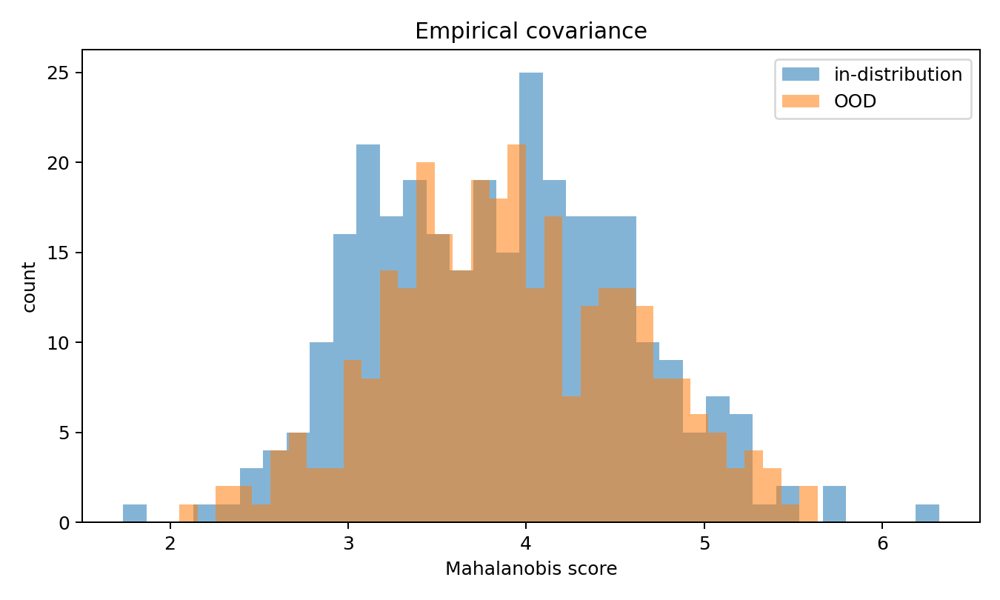
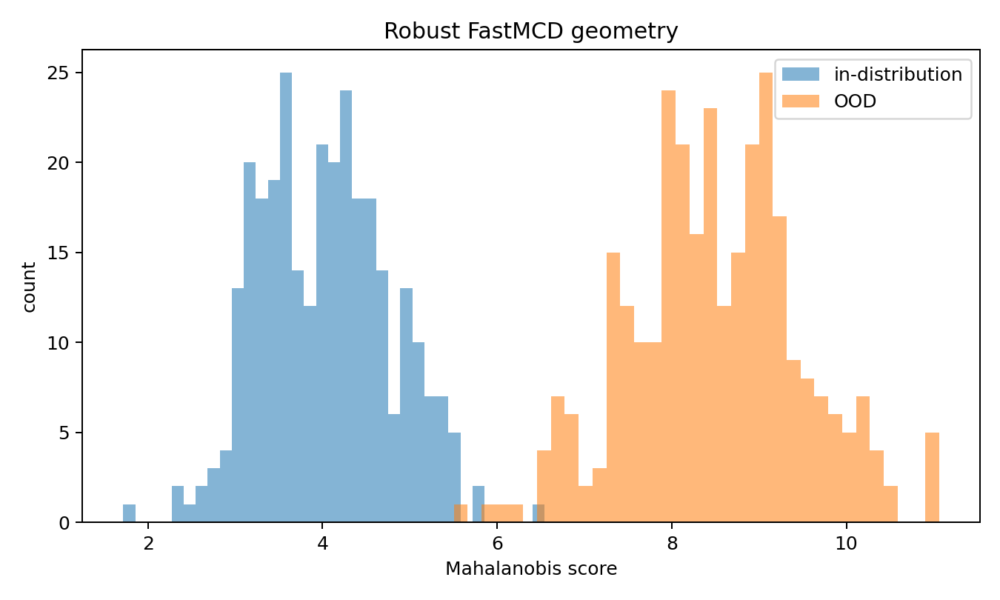
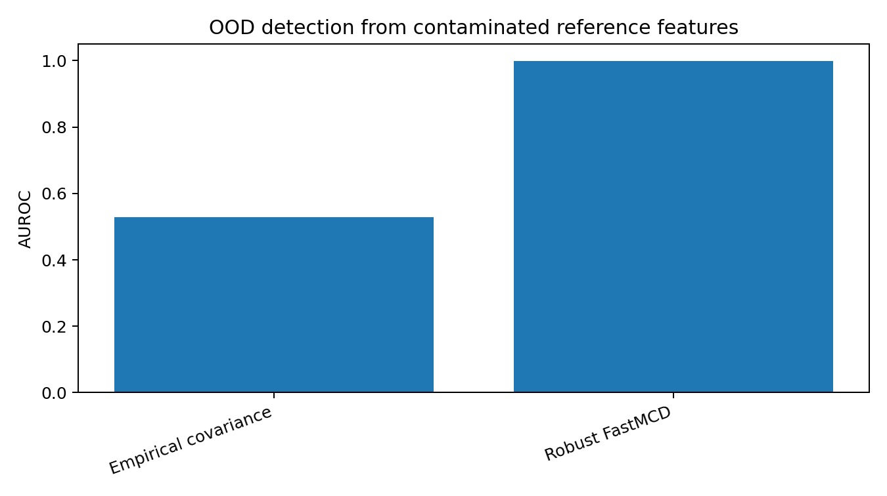

Robust feature geometry for synthetic OOD
=========================================

This example shows how ``robustcov`` can be used as a robust geometry layer on
top of learned representations.

The package does not train a neural network in this example.  Instead, it starts
from a feature matrix, as if the features had already been produced by a frozen
image model, text encoder, autoencoder, or penultimate neural-network layer.

The example is intentionally synthetic.  It is designed to illustrate one
specific failure mode:

* the reference feature set contains leverage-like contamination;
* empirical covariance inflates variance in the contaminated direction;
* Mahalanobis scores computed from empirical covariance become weak OOD scores;
* robust scatter geometry preserves the central feature-space metric more
  stably.

Run the example
---------------

.. code-block:: bash

   python examples/feature_geometry_synthetic_ood.py

Captured output
---------------

.. literalinclude:: ../_static/gallery/feature_geometry_synthetic_ood_output.txt
   :language: text

Score distributions
-------------------

Empirical covariance
~~~~~~~~~~~~~~~~~~~~

Robust FastMCD geometry
~~~~~~~~~~~~~~~~~~~~~~~

   
AUROC summary
-------------

Interpretation
--------------

The example is constructed so that the clean feature distribution has low
variance along one informative direction.  OOD samples move in that direction.
The reference set, however, is contaminated by leverage-like points in the same
direction.

An empirical covariance estimate absorbs those leverage points by inflating the
variance along the contaminated direction.  As a result, empirical Mahalanobis
scores become less sensitive to the OOD shift.

A robust scatter estimate is less affected by the leverage-like reference
contamination.  The resulting robust feature geometry gives larger separation
between in-distribution and OOD test features.

This should be read as a diagnostic example, not as a universal benchmark.  It
illustrates the role of ``robustcov`` as a lightweight geometry layer for feature
matrices produced by representation models.
