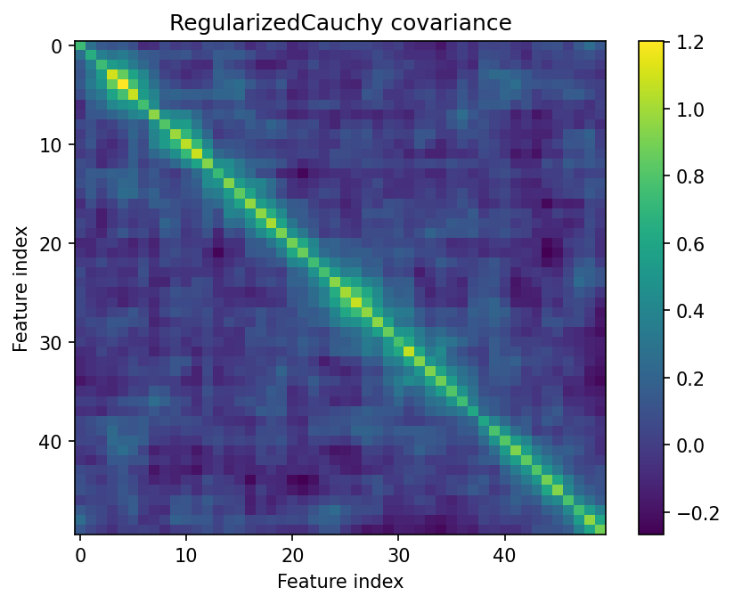
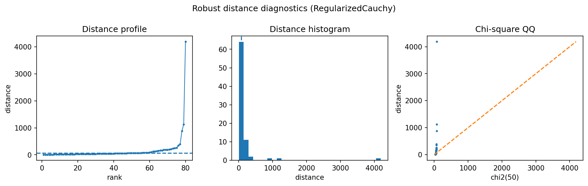

Finance-style heavy-tail covariance
===================================

Financial returns are often heavy-tailed and high-dimensional relative to the sample size.  This example asks a practical risk question: which covariance estimate stays stable when the sample is small and tails are heavy?

Result at a glance
------------------

Empirical covariance has a relative Frobenius error around 9.32 and condition number above 6300.  RegularizedCauchy, StudentTScatter, and RegularizedTyler all reduce the error below 0.48 and keep the condition number much more controlled.

What the data represent
-----------------------

The simulation uses ``n=80`` observations, ``p=50`` assets/features, and Student-t-like heavy tails with ``df=2``.  This is intentionally a small-sample risk regime where ordinary covariance is fragile.

Why this estimator
------------------

``RegularizedCauchy`` is the recommended default here.  It combines strong radial downweighting with shrinkage, which is useful when a few large return vectors can dominate empirical covariance.

Reproduce the result
--------------------

.. code-block:: bash

   python examples/use_case_finance_risk.py

Output from the run
-------------------

.. literalinclude:: ../_static/gallery/finance_risk/output.txt
   :language: text

Figures and diagnostics
-----------------------

How to read the result
----------------------

The heatmap and distance diagnostics should be read together.  A good risk estimator is not only lower-error in the synthetic benchmark; it should also avoid extreme condition numbers and produce a distance distribution that does not collapse around a few tail observations.

What this does not prove
------------------------

For real portfolios, covariance quality should be validated through downstream risk forecasts, drawdown behavior, and transaction-cost-aware portfolio tests.
