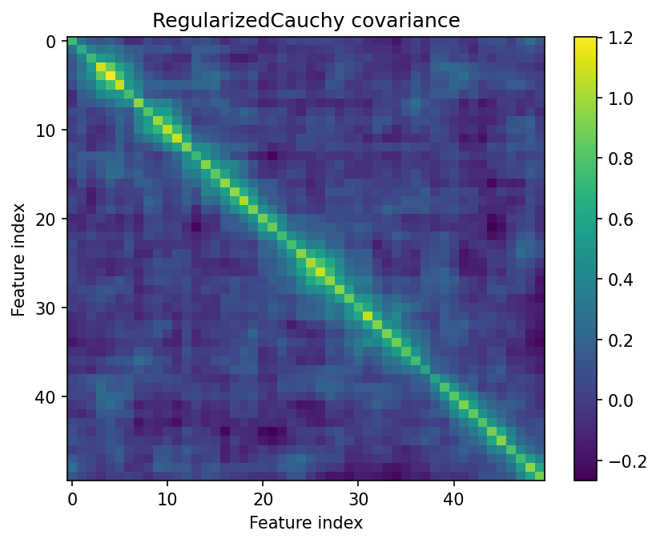
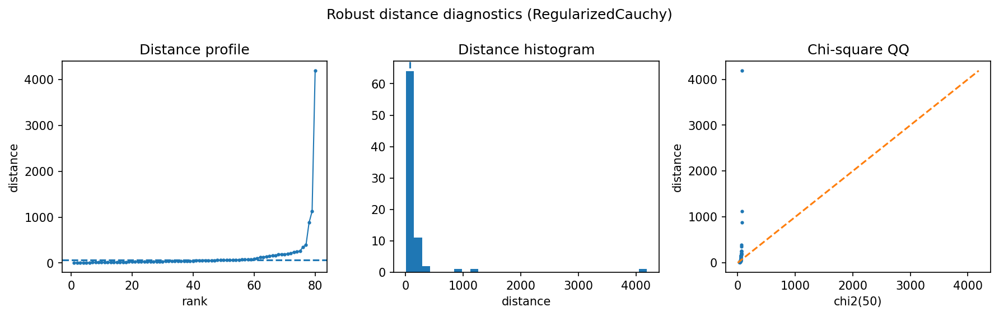

:orphan:

Finance-style heavy-tail covariance
===================================

This example compares covariance estimates in a difficult but common regime: 50 return series, only 80 observations, and very heavy tails.

Numerical result
----------------

Empirical covariance has a relative Frobenius error around 9.32 and condition number above 6300.  RegularizedCauchy, StudentTScatter, and RegularizedTyler all reduce the error below 0.48 and keep the condition number much more controlled.

Small-sample return model
-------------------------

The simulation uses ``n=80`` observations, ``p=50`` assets/features, and Student-t-like heavy tails with ``df=2``.  This is intentionally a small-sample risk regime where ordinary covariance is fragile.

Regularization and heavy tails
------------------------------

``RegularizedCauchy`` combines radial downweighting with shrinkage.  In this simulation, that prevents a few large return vectors from dominating the covariance while keeping the matrix invertible.

Run the example
---------------

.. code-block:: bash

   python examples/use_case_finance_risk.py

Console output
--------------

.. literalinclude:: ../_static/gallery/finance_risk/output.txt
   :language: text

Covariance and distance plots
-----------------------------

What to compare
---------------

The heatmap and distance diagnostics should be read together.  A good risk estimator is not only lower-error in the synthetic benchmark; it should also avoid extreme condition numbers and produce a distance distribution that does not collapse around a few tail observations.

Portfolio validation
--------------------

For real portfolios, covariance quality should be validated through downstream risk forecasts, drawdown behavior, and transaction-cost-aware portfolio tests.
