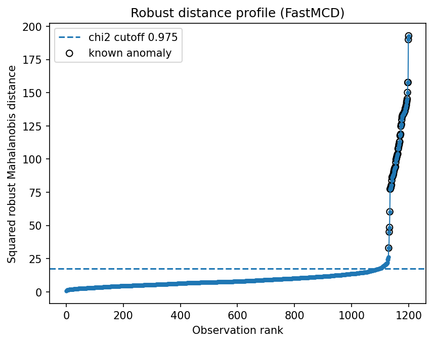
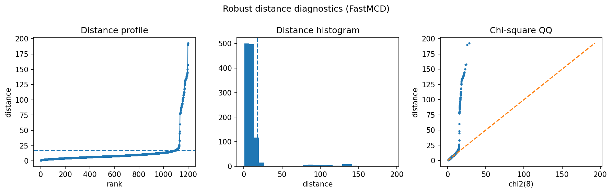

Fraud-style tabular anomaly screening
=====================================

This example is the small, readable version of the credit-card fraud story.  The data mimic ordinary transactions with a small suspicious tail, and robust distances are used as a ranking signal rather than as a black-box classifier.

Result at a glance
------------------

FastMCD recovers almost all injected suspicious rows in this synthetic tabular setting: precision and recall are both about 0.986 with 70 flagged rows.  The useful point is not just the score; the distance profile gives an interpretable audit trail for why those rows were flagged.

What the data represent
-----------------------

The generator creates transaction-like numerical features with a dominant clean population and a small group of shifted suspicious observations.  This matches the regime where global robust covariance is usually appropriate: one main cloud plus separated anomalies.

Why this estimator
------------------

``FastMCD`` with a robust-distance threshold.  FastMCD is a good first choice when anomalies are expected to sit outside a mostly elliptical normal bulk.

Reproduce the result
--------------------

.. code-block:: bash

   python examples/use_case_fraud_screening.py

Output from the run
-------------------

.. literalinclude:: ../_static/gallery/fraud_screening/output.txt
   :language: text

Figures and diagnostics
-----------------------

How to read the result
----------------------

Read the profile from left to right: the flat central region is the normal population and the rising tail is the suspicious queue.  A sharp tail is a good sign for review workflows because it means the highest-ranked transactions are meaningfully different from the bulk.

What this does not prove
------------------------

In real fraud systems, labels, transaction history, and categorical features matter.  Treat robustcov scores as a high-signal unsupervised feature or triage layer, not a complete fraud model.
