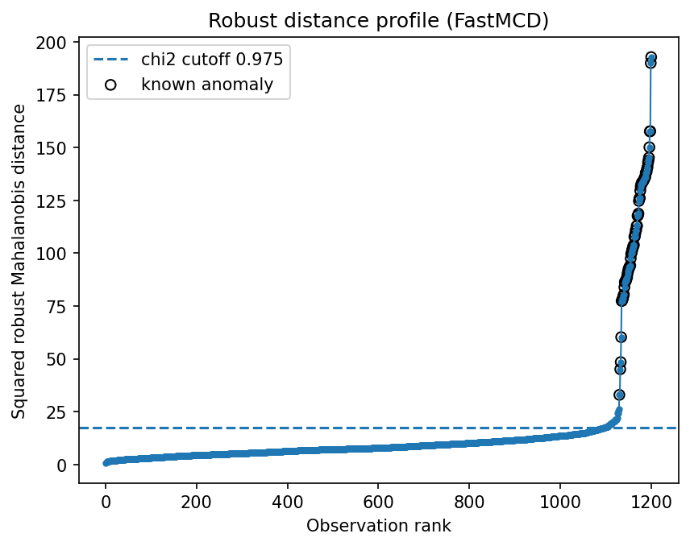
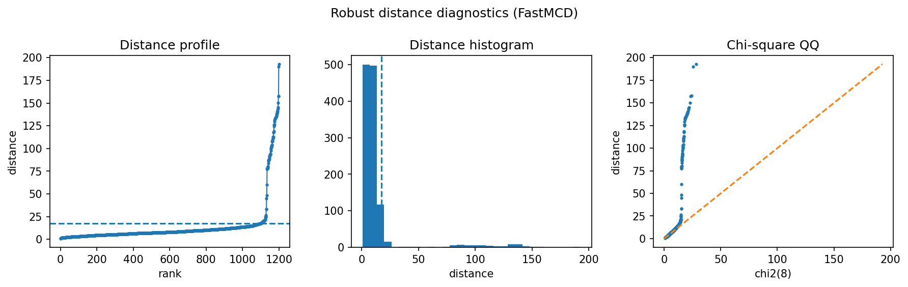

Fraud-style tabular anomaly screening
=====================================

The simulation contains a large group of ordinary transactions and a small shifted group.  Robust distance is used to rank rows for review rather than to replace a supervised fraud model.

Screening result
----------------

FastMCD recovers almost all injected suspicious rows: precision and recall are both about 0.986 with 70 flags.  The distance profile also shows whether the flagged rows form a distinct tail or sit close to the main population.

Transaction simulation
----------------------

The generator creates transaction-like numerical features with a dominant clean population and a small group of shifted suspicious observations.  This matches the regime where global robust covariance is usually appropriate: one main cloud plus separated anomalies.

Model choice
------------

``FastMCD`` with a robust-distance threshold.  FastMCD is a good first choice when anomalies are expected to sit outside a mostly elliptical normal bulk.

Run the example
---------------

.. code-block:: bash

   python examples/use_case_fraud_screening.py

Console output
--------------

.. literalinclude:: ../_static/gallery/fraud_screening/output.txt
   :language: text

Review plots
------------

Using the ranked queue
----------------------

Read the profile from left to right: the flat central region is the normal population and the rising tail is the suspicious queue.  A sharp tail is a good sign for review workflows because it means the highest-ranked transactions are meaningfully different from the bulk.

Production fraud systems
------------------------

In real fraud systems, labels, transaction history, and categorical features matter.  Treat robustcov scores as a high-signal unsupervised feature or triage layer, not a complete fraud model.
