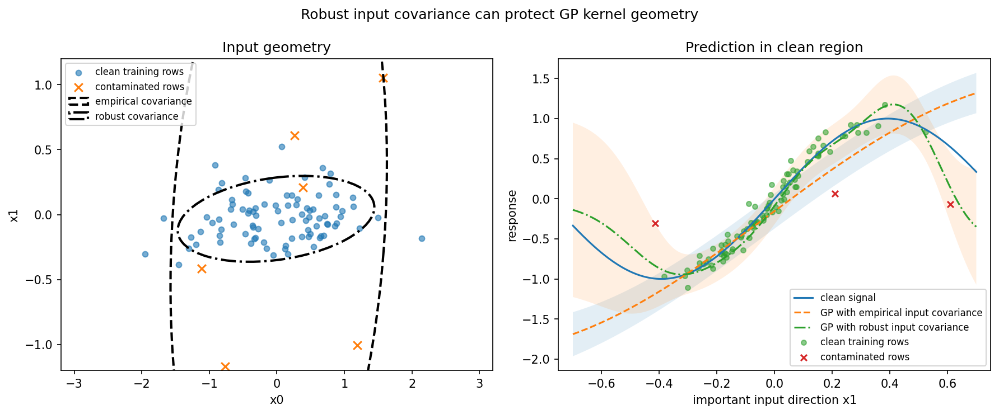

Robust GP kernel / input metric
===============================

This example shows how robust covariance estimators from ``robustcov`` can be
used as input-space metrics for Gaussian-process kernels.

``robustcov`` does not implement Gaussian-process regression, kernel ridge
regression, likelihoods, posterior inference, Bayesian optimization, or training
loops.  The GP library owns those pieces.  ``robustcov`` only supplies robust
input-space covariance geometry.

Result at a glance
------------------

The contaminated design points inflate the ordinary empirical input covariance.
A GP kernel based on that non-robust geometry can oversmooth along an important
input direction.  The robust input metric is less distorted.

What the data represent
-----------------------

The synthetic training set has two input features.  The response depends mostly
on the second feature.  A small number of contaminated rows are placed far away
in that same direction with unrelated responses.

Why this estimator
------------------

``FastMCD`` is used because this is a low-dimensional contaminated-design
example with separable leverage points.  The resulting robust precision matrix
is passed into a scikit-learn-compatible Mahalanobis RBF kernel.

Reproduce the result
--------------------

.. code-block:: bash

   python examples/gp_robust_input_metric.py

Output from the run
-------------------

.. literalinclude:: ../_static/gallery/gp_robust_input_metric/output.txt
   :language: text

Figures and diagnostics
-----------------------

How to read the result
----------------------

Compare the empirical-kernel GP curve with the robust-kernel GP curve.  The GP
model and training machinery are the same; only the input-space covariance
geometry changes.

What this does not prove
------------------------

This is not a robust GP likelihood and it does not make the model robust to
outliers in ``y``.  Output-side robustness belongs to the GP library through
likelihoods, noise models, or inference choices.
