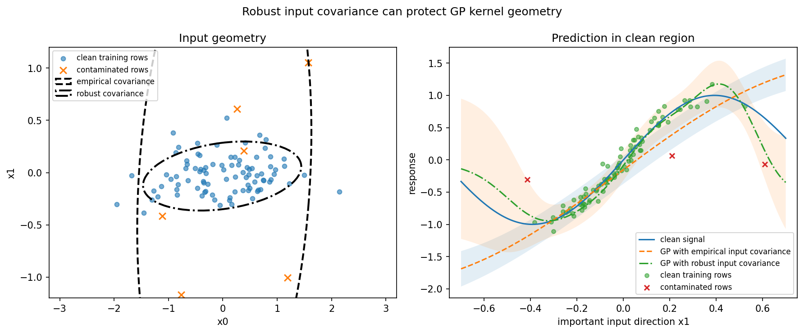

:orphan:

Robust GP kernel / input metric
===============================

This example shows how robust covariance estimators from ``robustcov`` can be
used as input-space metrics for Gaussian-process kernels.

``robustcov`` does not implement Gaussian-process regression, kernel ridge
regression, likelihoods, posterior inference, Bayesian optimization, or training
loops.  The GP library owns those pieces.  ``robustcov`` only supplies robust
input-space covariance geometry.

Effect on the fitted GP
-----------------------

The contaminated design points inflate the empirical variance in an important input direction.  An RBF kernel built from that metric then changes too slowly along the same direction.  Replacing the metric with a robust precision matrix reduces the distortion.

Contaminated design points
--------------------------

The synthetic training set has two input features.  The response depends mostly
on the second feature.  A small number of contaminated rows are placed far away
in that same direction with unrelated responses.

Robust input metric
-------------------

``FastMCD`` is used because this is a low-dimensional contaminated-design
example with separable leverage points.  The resulting robust precision matrix
is passed into a scikit-learn-compatible Mahalanobis RBF kernel.

Run the example
---------------

.. code-block:: bash

   python examples/gp_robust_input_metric.py

Console output
--------------

.. literalinclude:: ../_static/gallery/gp_robust_input_metric/output.txt
   :language: text

Prediction plots
----------------

What changes between the two fits
---------------------------------

Compare the empirical-kernel GP curve with the robust-kernel GP curve.  The GP
model and training machinery are the same; only the input-space covariance
geometry changes.

Output-side outliers
--------------------

Only the input metric is changed.  Outliers in ``y`` still require a suitable likelihood, noise model, or inference method in the GP library.
