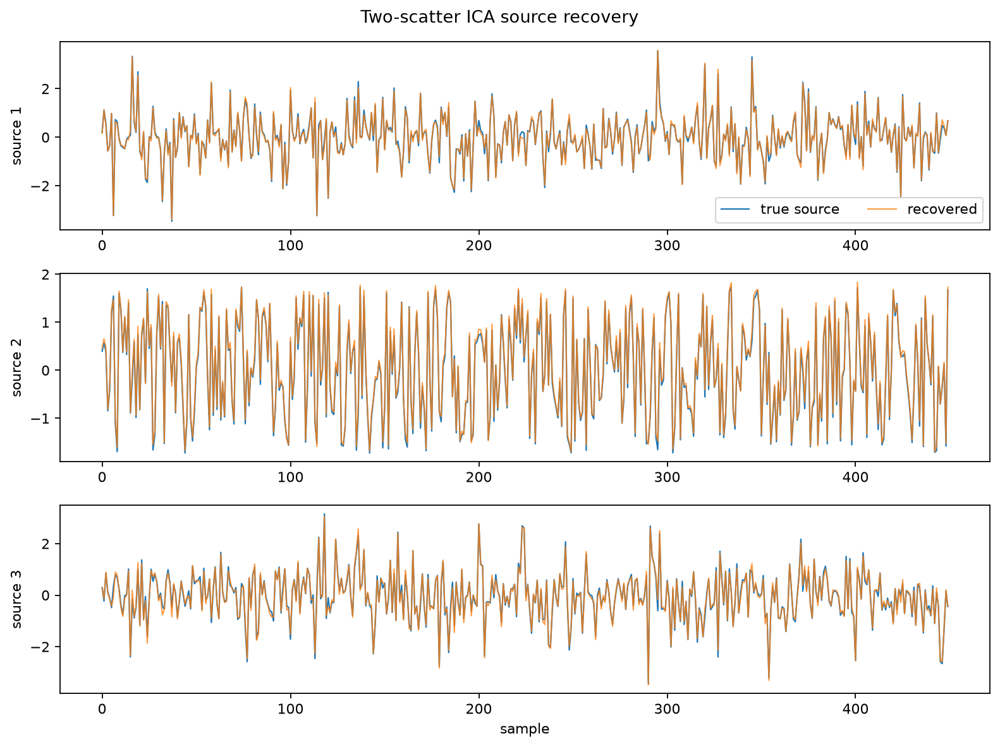
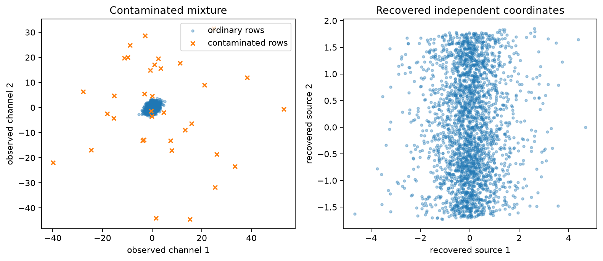

:orphan:

Robust two-scatter ICA
======================

Independent component analysis separates a linear mixture into statistically
independent latent signals.  ``TwoScatterICA`` uses robust scatter geometry for
whitening and a bounded radial scatter for component identification, making the
workflow less sensitive to a small number of contaminated rows.

Use this example when
---------------------

* observations are instantaneous linear mixtures;
* the latent sources are independent and have distinguishable marginal shapes;
* a minority of complete observations may be corrupted;
* source order, sign, and scale are not intrinsically identifiable.

Run the example
---------------

.. code-block:: bash

   python examples/ica_two_scatter.py

.. literalinclude:: ../_static/gallery/ica_two_scatter/output.txt
   :language: text
   :caption: Console output

Source recovery
---------------

The recovered components are aligned to the known synthetic sources only for
visualization.  The estimator itself does not use the source labels.

Mixture geometry
----------------

The left panel shows how a few contaminated rows distort the observed mixture.
The right panel shows the recovered independent coordinates for the clean
mixture.

The minimum-distance and Amari indices compare the fitted unmixing matrix with
the known synthetic mixing matrix after accounting for permutation and scale.
Lower values indicate better recovery.

Source
------

.. literalinclude:: ../../examples/ica_two_scatter.py
   :language: python
   :caption: examples/ica_two_scatter.py
