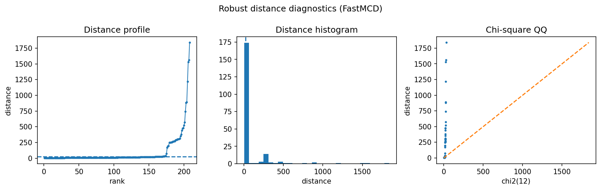

Image-feature one-class anomaly detection
=========================================

This example uses image-derived features rather than raw pixels.  The question is whether robust distances can flag images from a different class when trained on a single normal class.

Result at a glance
------------------

For the digits setup, robust distances detect 90% of the anomaly digit at the fixed detection budget.  The radial kurtosis is high, which is common when image features contain a small separated class.

What the data represent
-----------------------

The example uses sklearn digits features after dimensionality reduction/feature extraction.  One digit is treated as normal and another as the anomaly class.

Why this estimator
------------------

``FastMCD`` is a good baseline for one-class feature vectors when the normal class is compact.  For multiple normal styles, use the multimodal detector.

Reproduce the result
--------------------

.. code-block:: bash

   python examples/use_case_image_feature_anomaly.py

Output from the run
-------------------

.. literalinclude:: ../_static/gallery/image_feature_anomaly/output.txt
   :language: text

Figures and diagnostics
-----------------------

How to read the result
----------------------

The distance panel should show whether anomaly images occupy the high-distance tail.  If errors concentrate in ambiguous images, the robust score can still be useful as a review priority.

What this does not prove
------------------------

For modern image anomaly detection, deep embeddings are usually better than raw low-dimensional features.  robustcov is most useful after feature extraction.
