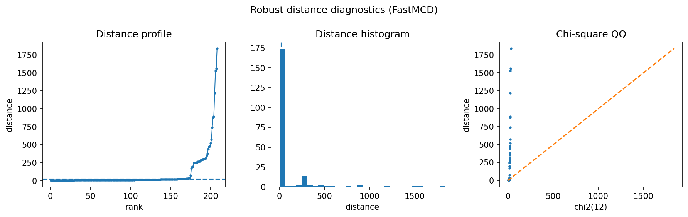

:orphan:

Image-feature one-class anomaly detection
=========================================

This example uses image-derived features rather than raw pixels.  The question is whether robust distances can flag images from a different class when trained on a single normal class.

Detection result
----------------

At the fixed detection budget, robust distance finds 90% of the held-out digit.  Radial kurtosis is high because the anomaly class forms a separated group rather than a Gaussian tail.

Image-feature setup
-------------------

The example uses sklearn digits features after dimensionality reduction/feature extraction.  One digit is treated as normal and another as the anomaly class.

FastMCD as a one-class baseline
-------------------------------

``FastMCD`` is a good baseline for one-class feature vectors when the normal class is compact.  For multiple normal styles, use the multimodal detector.

Run the example
---------------

.. code-block:: bash

   python examples/use_case_image_feature_anomaly.py

Console output
--------------

.. literalinclude:: ../_static/gallery/image_feature_anomaly/output.txt
   :language: text

Distance plots
--------------

Inspecting the ranked images
----------------------------

The distance panel should show whether anomaly images occupy the high-distance tail.  If errors concentrate in ambiguous images, the robust score can still be useful as a review priority.

Feature quality matters
-----------------------

For larger image problems, the same workflow is usually applied to embeddings from an image model rather than to raw pixels.  The quality of those features will dominate the final result.
