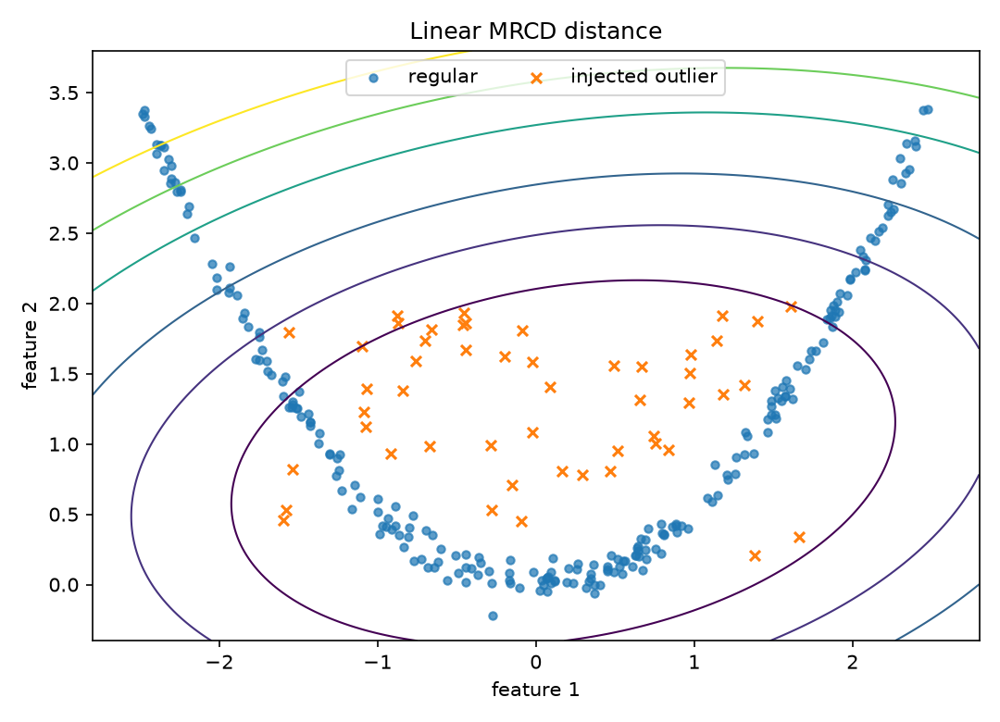
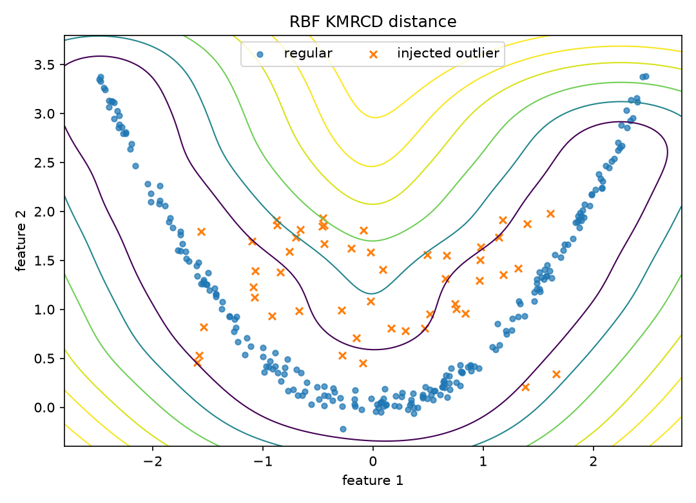
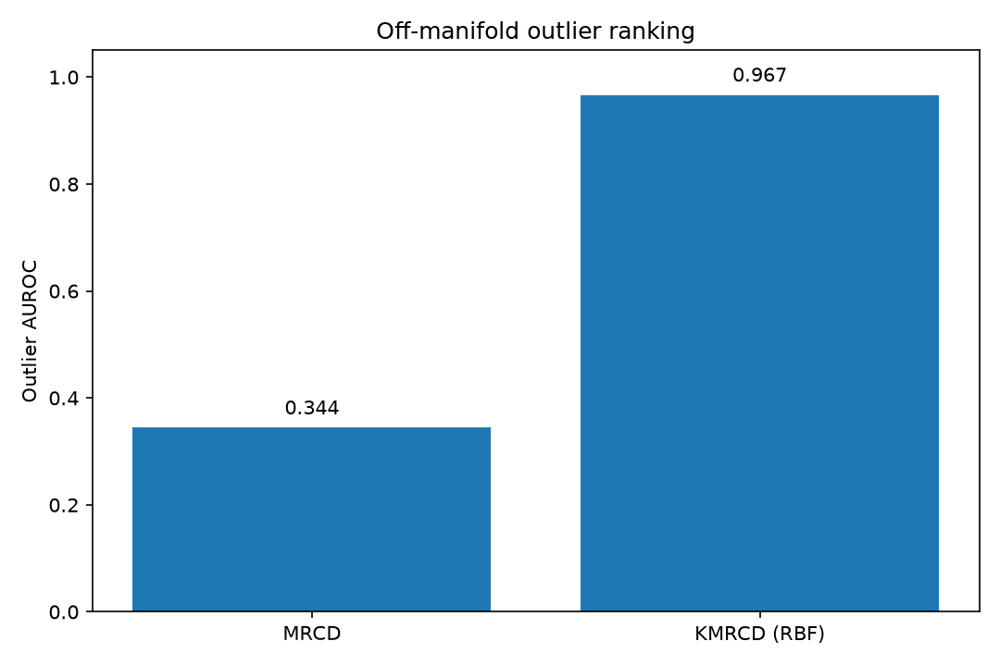
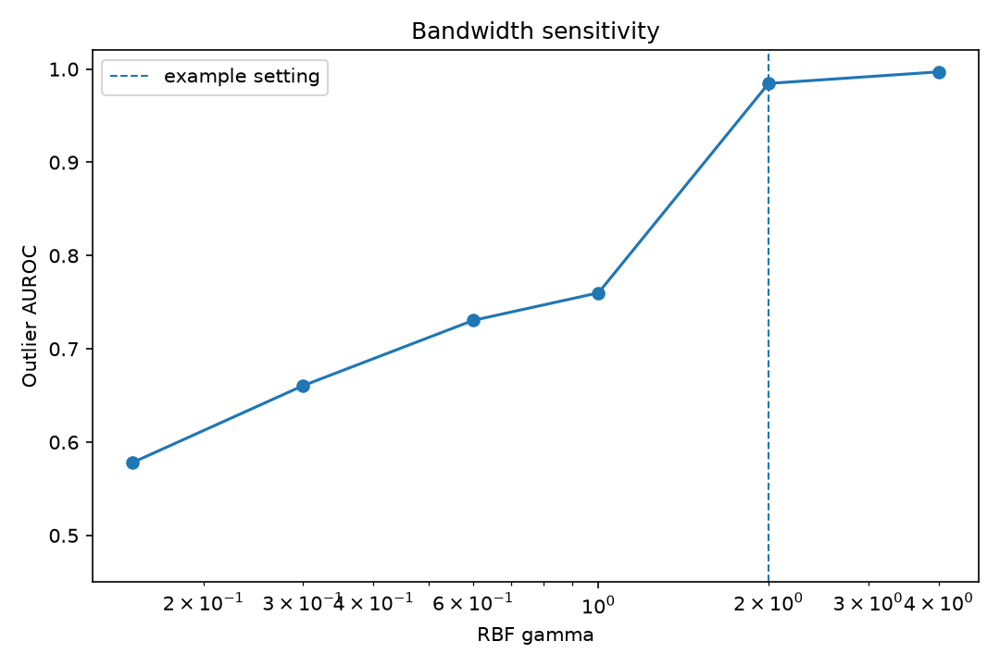

Kernel MRCD on a curved manifold
================================

This example uses a two-dimensional problem where the regular observations lie
near a noisy parabola.  The injected outliers sit inside the broad linear
covariance envelope but away from the curve.  A linear covariance model cannot
represent that distinction directly.

The comparison is between ``MRCD`` in the original coordinates and ``KMRCD``
with an RBF kernel.  The RBF setting is fixed for this example rather than tuned
on the labels.

.. literalinclude:: ../../examples/plot_kmrcd_nonlinear_manifold.py
   :language: python
   :linenos:

Observed output
---------------

.. literalinclude:: ../_static/gallery/kmrcd_nonlinear_manifold/output.txt
   :language: text

Linear geometry
---------------

The linear robust distance follows broad elliptical contours.  Points between
the two sides of the parabola can therefore look ordinary even though they are
far from the observed curve.

Kernel geometry
---------------

The RBF kernel creates a feature-space geometry in which points near the curve
remain similar and off-manifold observations receive larger robust distances.

Outlier ranking
---------------

Bandwidth sensitivity
---------------------

The result is not kernel-free.  Small and large RBF bandwidths produce different
feature-space neighborhoods, so a practical analysis should report the chosen
``gamma`` and check whether conclusions persist over a defensible range.

The injected labels are available here because this is a simulation.  Real data
usually do not provide an AUROC target, so bandwidth checks should instead use
stability, subject-matter constraints, or downstream validation.
