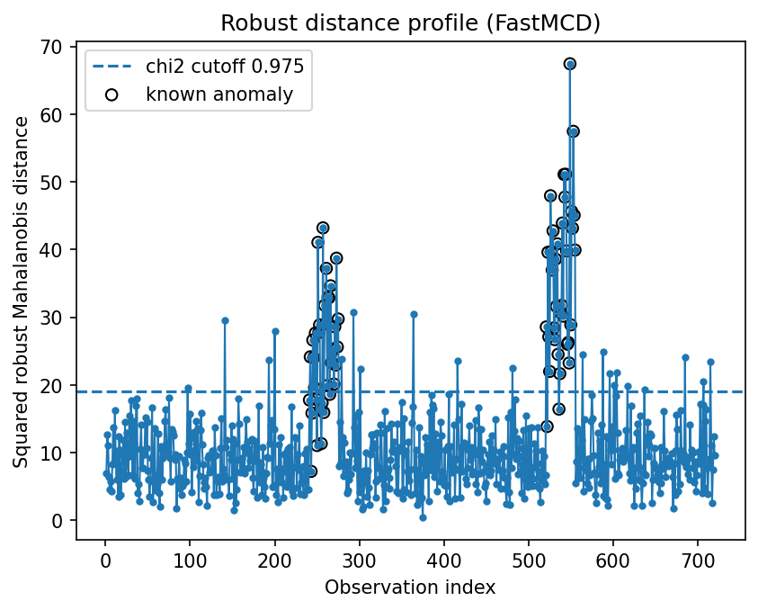
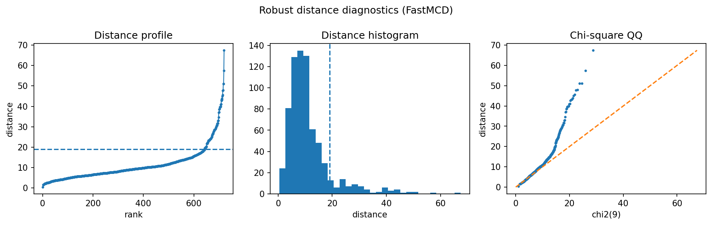

Predictive-maintenance monitoring
=================================

Predictive maintenance often starts with the same practical need: rank machine states by how unusual their multivariate sensor pattern looks.

Result at a glance
------------------

The synthetic monitoring example reaches precision and recall around 0.786.  It is intentionally less perfect than the simple sensor example, which makes it a better reminder that faults may overlap with normal operating variation.

What the data represent
-----------------------

The simulation creates time-like machine states with correlated sensor features and injected degradation/fault periods.

Why this estimator
------------------

``FastMCD`` or ``AutoRobustAnomalyDetector`` are reasonable first choices.  The robust distance becomes a health score that can be tracked over time.

Reproduce the result
--------------------

.. code-block:: bash

   python examples/use_case_maintenance_monitoring.py

Output from the run
-------------------

.. literalinclude:: ../_static/gallery/maintenance_monitoring/output.txt
   :language: text

Figures and diagnostics
-----------------------

How to read the result
----------------------

The time profile is the most useful plot.  Look for sustained runs above threshold rather than isolated single-point spikes; sustained elevation is usually more actionable for maintenance.

What this does not prove
------------------------

Production monitoring should include temporal smoothing, operating-mode segmentation, and feedback from maintenance events.
