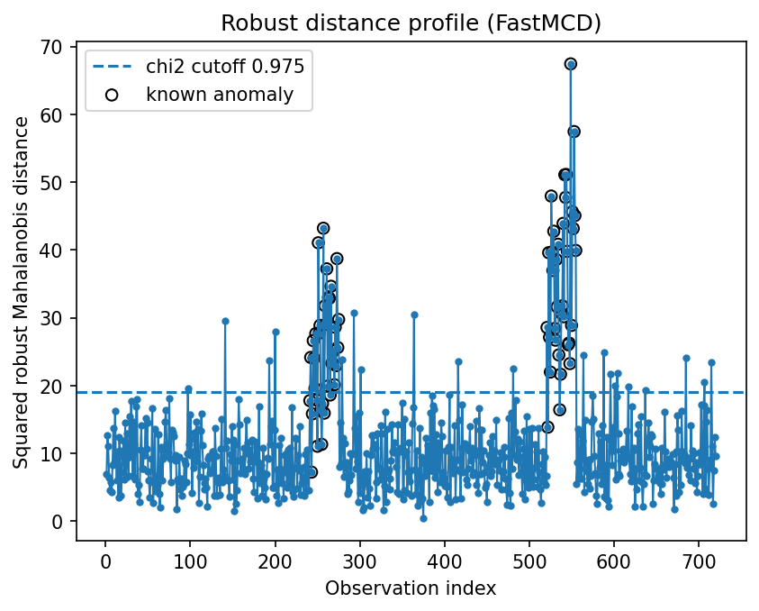
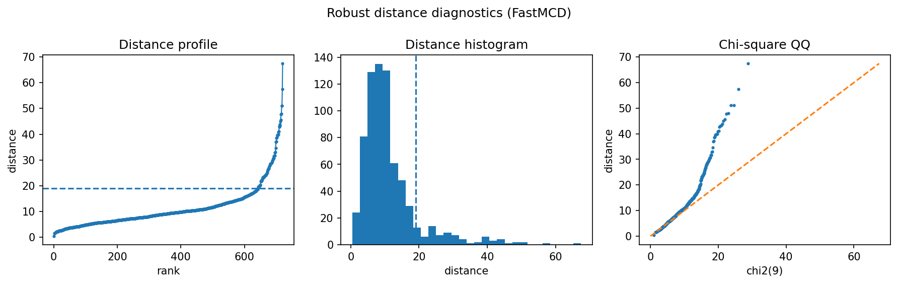

:orphan:

Predictive-maintenance monitoring
=================================

Predictive maintenance often starts with the same practical need: rank machine states by how unusual their multivariate sensor pattern looks.

Monitoring result
-----------------

Precision and recall are both about 0.786.  Several fault observations overlap the normal operating range, so the example produces the kind of ambiguous boundary seen in real maintenance data.

Machine-state simulation
------------------------

The simulation creates time-like machine states with correlated sensor features and injected degradation/fault periods.

Turning distance into a health score
------------------------------------

``FastMCD`` or ``AutoRobustAnomalyDetector`` can provide a scalar health score from the joint sensor vector.  The score is then tracked through time rather than interpreted only row by row.

Run the example
---------------

.. code-block:: bash

   python examples/use_case_maintenance_monitoring.py

Console output
--------------

.. literalinclude:: ../_static/gallery/maintenance_monitoring/output.txt
   :language: text

Time-series diagnostics
-----------------------

Look for sustained changes
--------------------------

The time profile is the most useful plot.  Look for sustained runs above threshold rather than isolated single-point spikes; sustained elevation is usually more actionable for maintenance.

Deployment considerations
-------------------------

Production monitoring should include temporal smoothing, operating-mode segmentation, and feedback from maintenance events.
