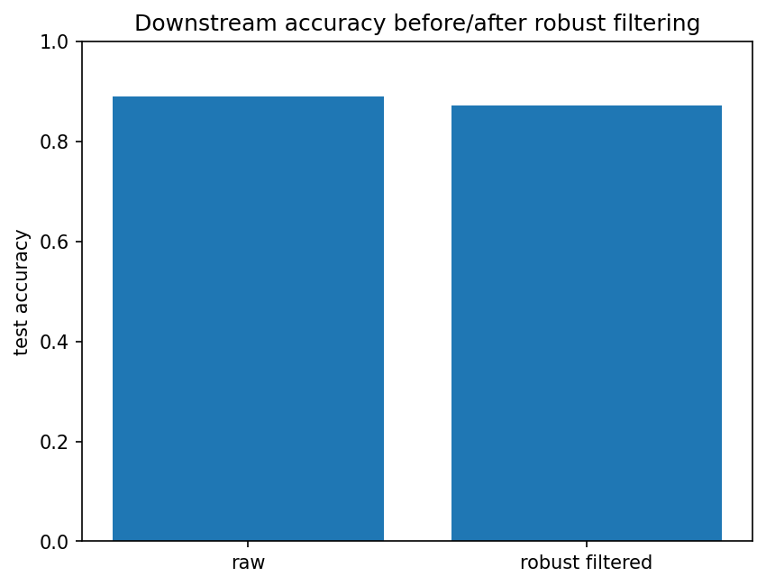
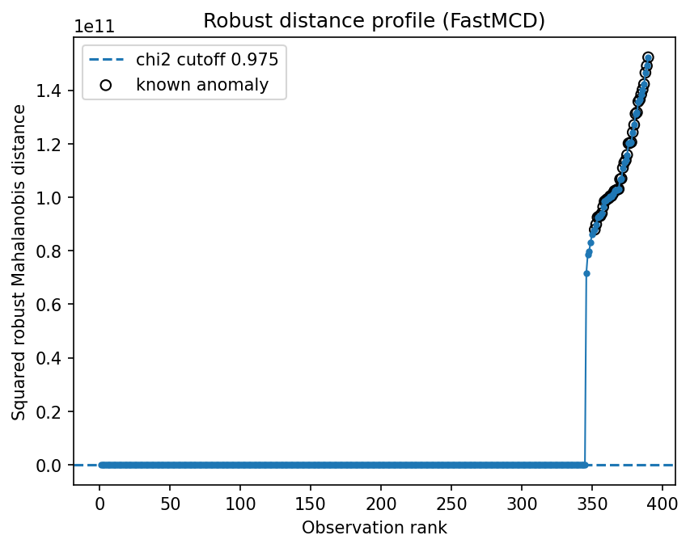

Robust preprocessing before classification
==========================================

Sometimes robust covariance is not the final model.  It can be a preprocessing step that identifies suspicious training rows before fitting a standard classifier.

Result at a glance
------------------

In this run, filtering removes 39 training rows.  The filtered classifier is slightly worse than the raw classifier, which is an important honest result: robust filtering is not automatically beneficial.

What the data represent
-----------------------

The example uses a noisy supervised classification problem.  robustcov scores are computed on the training features and high-distance rows are removed before refitting the classifier.

Why this estimator
------------------

``RegularizedCauchy`` or ``AutoRobustScatter`` is useful when the training set may contain heavy-tailed contamination.  The goal is not to win every classifier benchmark, but to diagnose influential or suspicious rows.

Reproduce the result
--------------------

.. code-block:: bash

   python examples/use_case_ml_preprocessing.py

Output from the run
-------------------

.. literalinclude:: ../_static/gallery/ml_preprocessing/output.txt
   :language: text

Figures and diagnostics
-----------------------

How to read the result
----------------------

Compare the accuracy plot before and after filtering.  If performance drops, the removed rows may be hard-but-valid training examples rather than harmful contamination.

What this does not prove
------------------------

Use this workflow with cross-validation.  Never filter using test labels, and do not assume that every outlier is an error.
