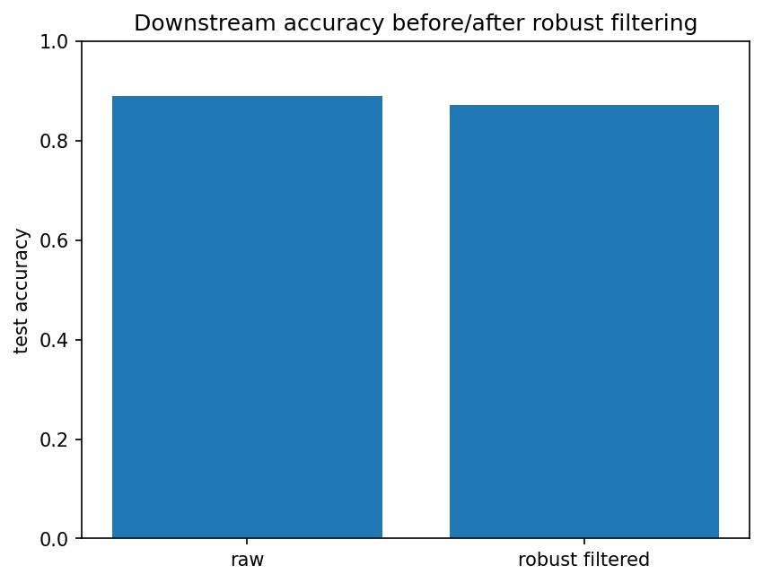
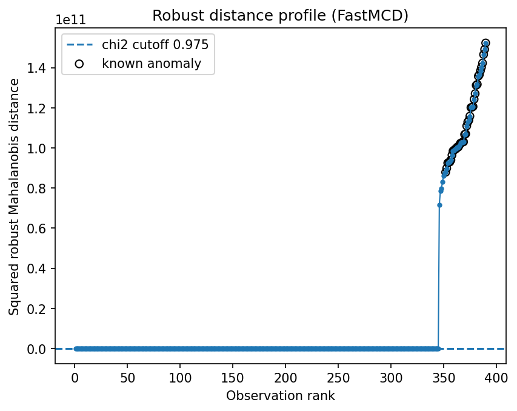

Robust preprocessing before classification
==========================================

Sometimes robust covariance is not the final model.  It can be a preprocessing step that identifies suspicious training rows before fitting a standard classifier.

What happened after filtering
-----------------------------

Filtering removes 39 training rows, but the refitted classifier is slightly worse.  The high-distance rows are therefore not simply bad data; some carry information that the classifier needs.

Training-data setup
-------------------

The example uses a noisy supervised classification problem.  robustcov scores are computed on the training features and high-distance rows are removed before refitting the classifier.

Using distance as an influence check
------------------------------------

``RegularizedCauchy`` or ``AutoRobustScatter`` can identify rows that strongly affect the feature geometry.  Whether those rows should be removed is a separate question that must be answered by cross-validation.

Run the example
---------------

.. code-block:: bash

   python examples/use_case_ml_preprocessing.py

Console output
--------------

.. literalinclude:: ../_static/gallery/ml_preprocessing/output.txt
   :language: text

Before-and-after plots
----------------------

When filtering hurts
--------------------

Compare the accuracy plot before and after filtering.  If performance drops, the removed rows may be hard-but-valid training examples rather than harmful contamination.

Validation rules
----------------

Use this workflow with cross-validation.  Never filter using test labels, and do not assume that every outlier is an error.
