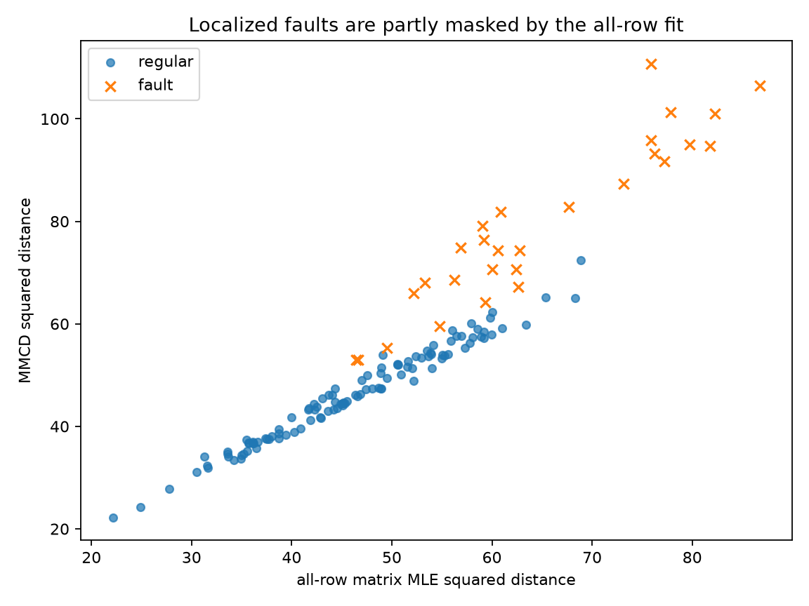
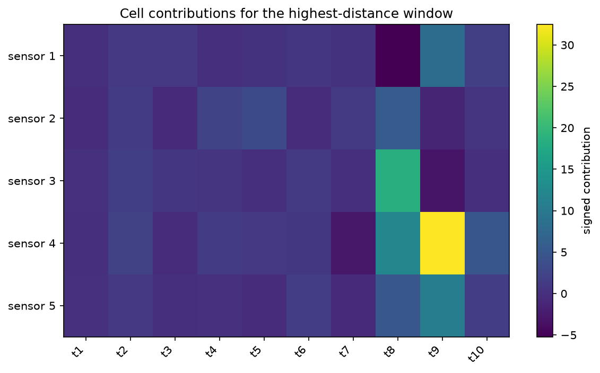
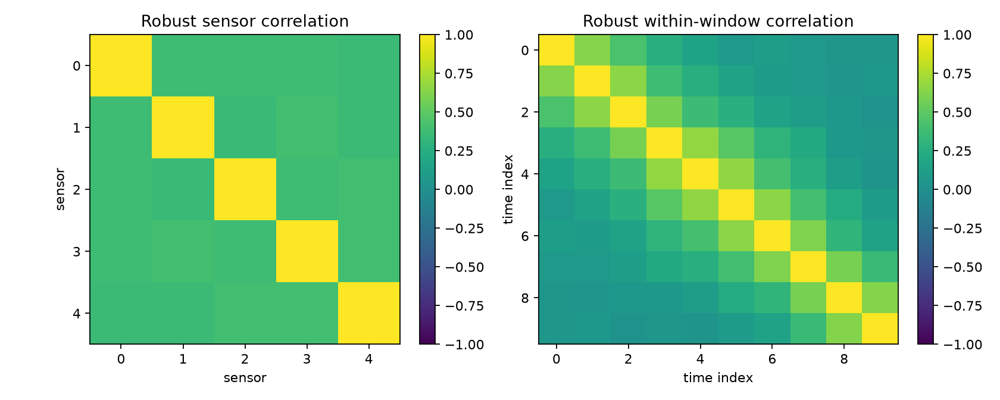

Matrix MCD for multichannel sensor windows
==========================================

Each observation in this example is a ``5 x 10`` matrix: five sensors measured
at ten positions within a short window.  Clean windows follow a matrix-normal
model with correlation between sensors and serial correlation within a window.
A minority of windows contains one of two localized fault patterns.

Flattening these observations would produce 50-dimensional vectors and discard
the distinction between sensor and time covariance.  ``MMCD`` instead estimates
a robust mean matrix, a ``5 x 5`` sensor covariance, and a ``10 x 10``
within-window covariance.

Run the example
---------------

.. code-block:: bash

   python examples/plot_mmcd_sensor_windows.py

.. literalinclude:: ../_static/gallery/mmcd_sensor_windows/output.txt
   :language: text
   :caption: Console output

Distance comparison
-------------------

The horizontal axis uses a matrix-normal fit based on every window.  The
vertical axis uses MMCD.  The all-row fit absorbs part of the recurring fault
patterns, while the subset fit leaves a larger separation between regular and
fault windows.

Which cells drive the distance?
-------------------------------

The contribution map is calculated for the highest-distance observation.  The
entries sum to that observation's squared matrix Mahalanobis distance.  Because
the calculation respects correlation, some individual signed contributions may
be negative.

Covariance factors
------------------

The two fitted correlation matrices describe different parts of the data
structure.  The left panel summarizes dependence between sensors; the right
panel summarizes dependence between positions within a window.

Scope
-----

The contamination in this example affects complete windows, even though its
visible effect is localized within each matrix.  MMCD is not a cellwise robust
estimator: a large number of independently corrupted cells spread across many
otherwise clean windows requires a different model.

Source
------

.. literalinclude:: ../../examples/plot_mmcd_sensor_windows.py
   :language: python
   :caption: examples/plot_mmcd_sensor_windows.py
